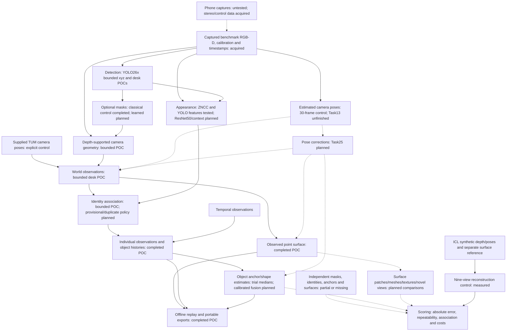

# FYLD scene-mapping research

This project asks whether phone captures can support measured maps of visible areas and a persistent object inventory. It is experimental. The evidence below separates supplied-input controls, bounded proofs of concept and untested comparisons.

Start with the [experiment guide](experiments/README.md), [object experiment evidence](experiments/06_object_recognition/README.md), [research coverage](research/README.md#research-agenda-4-october-2026) and [task board](task_list/README.md). The documentation reconciliation is Task30; no next experiment is started in this session.

## What we know

| Evidence | Data and measurement | What it establishes and its limit |
|---|---|---|
| [Geometry control](experiments/geometry_validation/README.md) and [surface control](experiments/04_surface_reconstruction/README.md#implemented-cpu-baseline) | Nine ICL views with supplied synthetic depth and poses: 2.73 million observed points, 7.85 mm mean reference distance, 22.29% whole-reference coverage within 5 cm | A bounded reconstruction control with an independent reference surface. It does not measure phone or street performance. |
| [Camera tracking](experiments/03_camera_pose_estimation/README.md#completed-cpu-trial) | Thirty TUM xyz observations: 6.93 mm camera-position error; 2.14 image pairs/s tracking, 1.69 frames/s including reporting | A short CPU development result. Task13's frozen full development and held-out runs remain unfinished. |
| [Task27 marked cup](experiments/06_object_recognition/pilot/runs/20261003T175727.913404Z_352c685ab5d24f16b31b50aa2cf50fb4/review.html) | One YOLO26x cup detection in Freiburg1 xyz, projected measured depth using supplied poses; 230,405 saved cloud points | Detection-to-scene proof of concept. Its surface sample is not the physical centre. This cup and the desk cup are not one verified physical object. |
| [Task17 references](experiments/06_object_recognition/datasets/README.md) and [Task18 detection](experiments/06_object_recognition/experiments/01_detection/README.md) | Six desk frames, eleven provisional cup/monitor observations; four of five annotated cup detections matched | Agent-reviewed, already inspected reference. Cup coverage is complete on these selected frames; monitors are a positive subset. No human gold or blind benchmark. |
| [Task19 masks](experiments/06_object_recognition/experiments/02_segmentation/README.md) | Rectangles, GrabCut and filled contours: 45 masks across 15 prompts; coordinates and costs compared | Masks change depth selection. Position/size accuracy improvement and learned segmentation remain untested. |
| [Task20 appearance](experiments/06_object_recognition/experiments/03_appearance/README.md) | ZNCC and existing YOLO26x pooled features tested; YOLO features made one incorrect monitor ranking | Exploratory appearance evidence. ResNet50 embeddings are untested. |
| [Task21 association](experiments/06_object_recognition/experiments/04_geometry_identity/README.md) | Geometry-only and combined rules each resolved eleven provisional observations; appearance-only left four unresolved | A bounded identity trial. It does not prove appearance and geometry are always both necessary. Task21 remains pending review. |
| [Task22 accepted replay](experiments/06_object_recognition/experiments/05_replay/runs/20261004T152704.023370Z_84abb8b3b9594dcea8a1e5b2c8aced66/review.html) | Sixty frames, 457 baseline proposals and a six-frame automatic comparison | Offline RGB-D replay with supplied poses and source-linked identities. Task22 remains pending review. |

[Task29 portable HTML](experiments/06_object_recognition/experiments/05_replay/runs/shareable/task22_20261004/task22_replay.html), [ZIP](experiments/06_object_recognition/experiments/05_replay/runs/shareable/task22_replay_20261004.zip), [all desk cup proposals](experiments/06_object_recognition/experiments/05_replay/runs/shareable/task22_20261004/cup_desk_observations.csv), [measurement definitions/results](experiments/06_object_recognition/experiments/05_replay/runs/shareable/task22_20261004/cup_repeatability.json) and [coordinate plot](experiments/06_object_recognition/experiments/05_replay/runs/shareable/task22_20261004/cup_repeatability.png) are local artifacts. Generated runs are not included in a fresh clone.

Sixteen assigned desk-cup observations have box-median RMS spread of **72.8 mm** and centre-sample RMS spread of **82.3 mm**. Maximum pairwise separations are **291.7 mm** and **317.0 mm**. These are visible-surface repeatability measurements around the observations' own median, with correlated frames and association-selected data. They are not absolute physical-centre accuracy. The **30.8 mm** return difference uses only two views.

The baseline's 95 book detections comprise one new ID, four matches and 90 unresolved outside the position gate. After a book track exists, its restrictive birth policy blocks later unmatched books from getting new IDs. This is a policy limitation; the baseline does not test book appearance failure.

## What remains uncertain

There is no independent physical-centre reference for the desk objects, no dense reference surface for this TUM replay and no validated uncertainty model. Object anchors, visible surfaces and complete-object dimensions need separate definitions and references. Neither cosine similarity, detector confidence nor depth-point spread is a calibrated location probability.

The current depth adapter excludes values at or beyond 4 m. Indoor results do not establish street-scale accuracy. Similar neighbours, identical objects seen only in separate views, controlled lighting/rotation, moving objects, full occlusion, new sessions and camera-origin recovery lack sufficient recorded evaluation evidence. Human-checked masks and independent held-out identities are acquisition gaps.

The S23 and Redmi Note 11 Pro are available, but neither phone's capture/depth support, timing, calibration, sustained processing, energy or thermal behaviour is measured. Task08 owns those checks; Task24 owns build recovery. [Phone plan](experiments/01_camera_capture_delivery/README.md). Task16's broader protocol stays pending review.

## Actual flow and planned comparisons

Solid arrows show exercised supplied-input paths. Dashed arrows show planned substitutions, corrections or evaluation. Each node states its evidence status.

An evaluated method uses references only for scoring, except an explicitly named supplied-pose or checked-mask control. Estimated poses must be compared separately on matching inputs. Source time, calibration, depth validity, scale, world/segment and pose revision must remain explicit.

## What to try next

The [board order](task_list/README.md#next-experiment-order-and-gaps) makes independent references the first acquisition decision. Then compare provisional-ID policies on cached proposals, rectangle/mask depth selection on the same images, spatial uncertainty models on checked supports, appearance methods on fixed crops, and sequential fusion under isolated perturbations. Add predicted masks/depth/poses one at a time before a combined trial. No success threshold is invented here.

[Research coverage](research/README.md#research-agenda-4-october-2026) includes ARCore, ARKit/RoomPlan and autonomous-driving sources. [ARCore Raw Depth](https://developers.google.com/ar/develop/java/depth/raw-depth) records confidence and distinguishes new from reprojected depth. [RoomPlan](https://developer.apple.com/augmented-reality/roomplan/) uses Apple camera-plus-LiDAR hardware; it is not a capability established on these Android phones. [Probabilistic detection review](https://arxiv.org/abs/2011.10671) motivates calibration evaluation, not a local uncertainty result.

Later review requirements include picking an object or surface in 3D, tracing every source/crop and accepted/rejected observation, inspecting provisional/duplicate links, individual positions and fused estimates, and displaying distance, observed dimensions and uncertainty. Task39 records this future requirement; a viewer does not prove measurement accuracy.

## Costs and repository use

Keep model load, inference, depth projection, feature extraction, assignment, fusion, pose correction/rebuild, publication and verification costs separate. Record acquisition/annotation labour, host/device memory, storage, capture coverage and hardware needs. Current desktop timings do not establish mobile feasibility. Existing YOLO26x terms and future model/data licences need review before deployment/acquisition.

Six independent experiment folders own capture, depth, camera estimation, reconstruction, top-down mapping and objects. [Shared contracts](experiments/shared/README.md) and [object agreements](experiments/06_object_recognition/shared/README.md) already exist. The [archive](archive/task00_prototype/README.md) preserves the preliminary prototype and unfinished validation.

Use [data acquisition records](data/README.md) and the [dataset guide](experiments/datasets/README.md) for provenance. Raw datasets, weights, reference checkouts, virtual environments and generated runs stay local. Do not equate availability in this checkout with a reproducible fresh-clone installation.

For implementation sessions, the existing check command is `python -B tools/check.py -q`; it places caches outside the repository. No implementation tests or experiment commands were run for Task30. Test counts remain supporting engineering receipts.

Other verified local views: [camera motion](experiments/03_camera_pose_estimation/runs/20261002T195923.778722Z_8bcaf965d8dc496192563205df59d85c/viewer.html), [surface](experiments/04_surface_reconstruction/runs/20261002T195928.219822Z_55d2d0bfa455453eb2289a5e717490c1/viewer.html), [portable camera](experiments/03_camera_pose_estimation/runs/shareable/camera_viewer.html) and [portable surface](experiments/04_surface_reconstruction/runs/shareable/surface_viewer.html).
