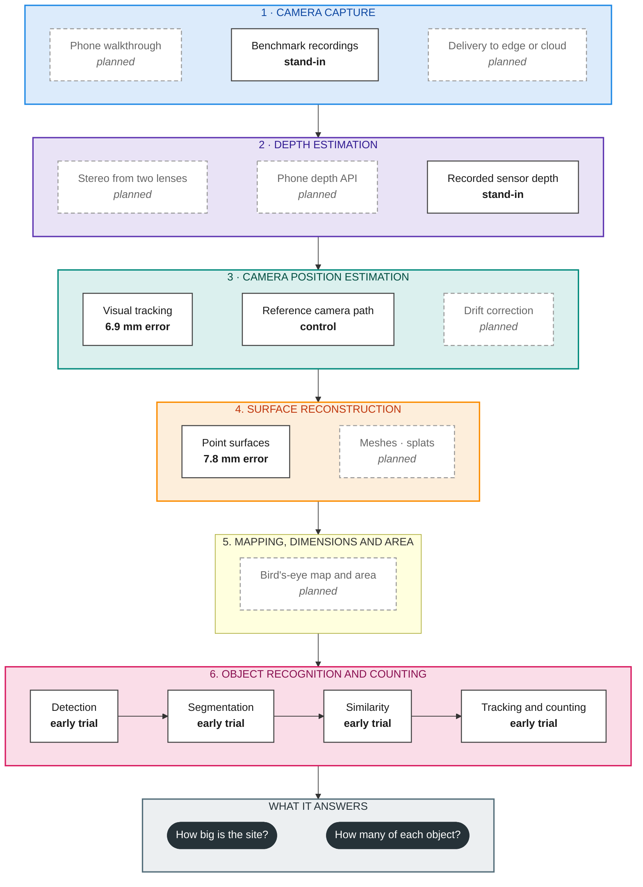

# Measuring worksites and counting objects from a phone walkthrough

This repository is a research project. It asks whether a person walking through a worksite with a phone can produce two useful outputs:

1. **A measured 3D model of the visible site**, so its size, areas and dimensions can be read off in metres.
2. **A count of distinct objects**, where an object that leaves the camera view and comes back is counted once, not twice.

The work is split into six execution steps. Each layer is built and tested on its own with known inputs, then connected to the others. This README explains the problem, the layers, what has been measured so far and what is still unknown. It is meant to be read on its own. The experiment folders hold the detail.

## Contents

- [The problem this solves](#the-problem-this-solves)
- [The six execution steps](#the-six-execution-steps)
- [Why build the layers separately](#why-build-the-layers-separately)
- [Hosted or on the phone](#hosted-or-on-the-phone)
- [Layer by layer](#layer-by-layer)
- [What has been measured so far](#what-has-been-measured-so-far)
- [What is still unknown](#what-is-still-unknown)
- [Data used for testing](#data-used-for-testing)
- [What comes next](#what-comes-next)
- [Possible later output: a phone VR viewer](#possible-later-output-a-phone-vr-viewer)
- [Repository layout and checks](#repository-layout-and-checks)
- [Terms used in this project](#terms-used-in-this-project)

## The problem this solves

FYLD suggested three research areas:

| Suggested area | How this project relates to it |
|---|---|
| Deployment pipelines for cloud and edge devices. MLflow and BentoML are used for cloud today; there is no plan for edge devices yet. | **One of three project goals, alongside accuracy and latency.** Shared records support replacing components, but do not establish phone compatibility or speed. The Android capability app has run on the Redmi; usable image capture and sustained workload performance remain unverified. Tasks52 and 57 own actual capture and deployment. |
| Identify a worksite from a first-person video walkthrough, then estimate its size. | **Main focus, layers 1 to 4.** A normal video is flat. To measure a site you need to know how far away each pixel is (depth, layer 2) and where the camera was for each frame (camera position, layer 3). Together these place every pixel in one shared 3D space in metres (layer 4). Size, area and a top-down map then come from that 3D model. Recognising a site on a return visit is part of layer 3: the camera tracker must notice it is somewhere it has been before. |
| Count objects in first-person video where an object can leave and re-enter the frame many times, efficiently. SAM works but is very heavy. | **Main focus, step 6.** Counting in 2D fails because the same cone or barrier looks like a new object each time it comes back into view. Once objects have a position in the shared 3D space, a returning object comes back at the same place, so position and appearance together can decide "same object" or "new object". On efficiency, the experiments test whether cheap boxes or simple masks are good enough before reaching for a heavy segmentation model, and record the cost of every step. |

## The six execution steps

Each coloured block is one layer. Boxes with a solid border work today; dashed boxes are planned. The word under each box gives its status:

- **measured**: scored against an independent reference, with an error in millimetres.
- **early trial**: works on a small recorded example and has been inspected, but has not been scored on a broad test.
- **stand-in** or **control**: a known-good input used in place of a layer that is not built yet, so the layers below can still be tested.
- **planned**: not built.



Read it top to bottom. Each layer can use the output of any layer above it, not only the one directly above. For example, object isolation uses the original images (layer 1), depth (layer 2) and camera positions (layer 3) to place each object, and its objects sit in the same 3D space as the environment model (layer 4). The site-size answer comes from step 5, using step 4 geometry; the object count comes from step 6.

## Why build the layers separately

If the final 3D model is wrong, you need to know which layer caused it. A bent wall could come from bad depth, a bad camera path or a bad surface-building step. Testing all of them together cannot tell these apart.

So each layer is first tested with **perfect inputs from the layers above it**. Public benchmark recordings supply measured depth and an exact reference camera path, recorded with motion-capture equipment. The surface-building layer can then be scored with depth and camera path known to be right. Any error is its own.

After a layer passes on its own, one stand-in at a time is swapped for a real layer. For example: build the surface with the reference camera path, then again with the tracked camera path, and measure how much worse it gets. That difference is the camera tracker's contribution to the error. Two stand-ins are never swapped in the same comparison.

This also makes each layer replaceable. A different depth model or camera tracker can be dropped in as long as it reads and writes the same records.

## Hosted or on the phone

There are two ways to deploy the same six execution steps.

- **Hosted.** The phone only records. It saves the video, the phone's motion sensors (accelerometer and gyroscope, together called the IMU) and the phone's own position and depth estimates, then uploads them. A server can run the heavier processing stages. Its full processing time and memory still need measuring. This fits the cloud serving FYLD already runs with MLflow and BentoML. The first software integration run is local prerecorded footage on MasterPC; it is not a deployment. Later work can add FastAPI input and camera streaming behind the same layer boundaries. Task56 tests the complete result.
- **On the phone, offline.** Some layers can run on the phone with no internet connection. The point is not the final answer. It is quick checks on site, so a worker does not leave with a capture that turns out to be unusable: "you missed the far corner", "tracking was lost here", "about 40 m² so far, 6 cones counted so far".

Google listed both candidate models as supporting ARCore depth when checked on 4 October 2026 ([ARCore supported devices](https://developers.google.com/ar/devices)). Only the Redmi is confirmed available for this test. A listing does not establish runtime support or measurement quality on the handset; those still need to be checked.

ARCore offers more than camera position and depth. Outdoors it can label every pixel as road, pavement, building, vehicle, person and so on (Scene Semantics). It can supply building and terrain shapes from Street View data within about 100 m (Streetscape Geometry), and can give a location fix with heading (Geospatial). The toolkit and phone-sensor inventory is recorded in [research/arcore](research/arcore/README.md). Task52 turns the selected inputs into a tested recording; the inventory itself establishes no runtime result.

| Layer | Hosted: phone records, server does the rest | On the phone, offline | Offline check worth doing on site |
|---|---|---|---|
| 🟦 1. Camera capture | Record video, IMU and ARCore pose and depth into one file with ARCore's [Recording and Playback API](https://developers.google.com/ar/develop/recording-and-playback). Upload on Wi-Fi to the server. | Same recording, kept on the phone. Android's [Camera2 multi-camera API](https://developer.android.com/media/camera/camera2/multi-camera) shows whether two rear lenses can record at once. | Blur, exposure and dropped-frame warnings. A coverage hint showing parts of the site not yet filmed. |
| 🟪 2. Depth estimation | Large learned models on every frame: [FoundationStereo](https://arxiv.org/abs/2501.09898) if two lenses can record together, otherwise multi-view depth from [Depth Anything 3](https://arxiv.org/abs/2511.10647) or [MapAnything](https://arxiv.org/abs/2509.13414). ARCore depth sets the real-world scale. | ARCore's [Depth API](https://developers.google.com/ar/develop/java/depth/raw-depth). Optionally a small learned model such as [Depth Anything V2](https://arxiv.org/abs/2406.09414) Small, run through [LiteRT](https://ai.google.dev/edge/litert) or [ONNX Runtime](https://onnxruntime.ai/docs/tutorials/mobile/) on the phone's AI chip. | Warn where depth is missing or the subject is too far away for reliable depth. |
| 🟩 3. Camera position | Full tracking with drift correction on the whole recording: [ORB-SLAM3](https://arxiv.org/abs/2007.11898) with the IMU, or the learned [MASt3R-SLAM](https://arxiv.org/abs/2412.12392) and [VGGT-SLAM 2.0](https://arxiv.org/abs/2601.19887). A final clean-up pass over all frames at once with [COLMAP](https://colmap.github.io/) or [GLOMAP](https://arxiv.org/abs/2407.20219). | ARCore motion tracking, which is built in and runs live. [RTAB-Map for Android](https://github.com/introlab/rtabmap) adds drift correction on top of ARCore's position. | "Tracking lost" alerts. A drift check: return to the starting spot and see how far the path has wandered. |
| 🟧 4. Surface reconstruction | Dense meshes from depth with [Open3D](https://www.open3d.org/docs/0.19.0/tutorial/pipelines/rgbd_integration.html) or [nvblox](https://arxiv.org/abs/2311.00626). Realistic views with [Gaussian splatting](https://arxiv.org/abs/2308.04079) or its surface-accurate variant [2DGS](https://arxiv.org/abs/2403.17888). Bird's-eye map and areas from the mesh. | ARCore's detected floor and wall planes plus its depth points, or RTAB-Map's on-phone mesh. A rough top-down preview. | Rough footprint and area in m². A map of gaps that were never filmed. |
| 5. Mapping, dimensions and area | Read full observed geometry and a defined reference plane to measure the site. Task55 owns the real method. | The selected edge method still needs implementation and measured evidence. | Defined area and dimensions with unknown coverage visible. |
| 🟥 6. Object recognition and counting | Detect, outline and follow objects named in plain text with [SAM 3](https://arxiv.org/abs/2511.16719) ("traffic cone", "barrier"). Compare appearance between sightings with [DINOv2](https://arxiv.org/abs/2304.07193) or [DINOv3](https://arxiv.org/abs/2508.10104) features. Build a 3D map of individual objects in the style of [ConceptGraphs](https://arxiv.org/abs/2309.16650). | A small detector trained on site object types: [RF-DETR](https://arxiv.org/abs/2511.09554) Nano or [YOLO26](https://docs.ultralytics.com/models/yolo26) nano. Short-term following with [ByteTrack](https://arxiv.org/abs/2110.06864). ARCore position and depth place each object in 3D so a returning object is not counted twice. [MobileSAM](https://arxiv.org/abs/2306.14289) only on chosen frames when an outline is needed. | A running provisional count, with uncertain or seen-once objects flagged for a second look. |

None of these methods has been measured on the two test phones yet. Published speeds come from the authors' own hardware and do not predict phone speed. Licences differ, and some forbid commercial use:
- ORB-SLAM3 is GPLv3.
- YOLO26 is AGPL-3.0 unless an enterprise licence is bought.
- MASt3R-SLAM and the original VGGT weights are non-commercial.
- RF-DETR, Open3D, MobileSAM and DINOv2 use permissive licences.

Check each licence before anything ships. Each layer README lists more options, with licences, under "Methods: hosted and on the phone".

## Layer by layer

### 🟦 1. Camera capture

**Question:** can a phone provide images, with capture times and lens calibration, that the other layers can use? Can they be delivered to an edge computer or cloud server?

- **In:** a chosen phone, camera settings and a recording request.
- **Out:** a saved bundle of images, each with camera identity, capture time and calibration (focal length, image centre, lens distortion and the offset between lenses).
- **Phone available:** Redmi Note 11 Pro 4G, model 2201116TG, Android 13; Samsung S23 availability is unconfirmed.
- **Where it stands:** a native Camera2 capability session from the Redmi lists one rear camera and one front camera, with no advertised simultaneous-camera sets. Its export contains no image captures. The staged camera APK still needs a verified rear-camera image export; runtime depth and camera position remain untested. The Android Debug Bridge (ADB) is available in WSL, but its latest device query found no attached handset. A local browser preview and video-stream test is possible over HTTPS, but it cannot report the native concurrent-camera support and sensor details needed to assess stereo.
- **Stand-in today:** public benchmark recordings (see [Data used for testing](#data-used-for-testing)).
- **Key sources:** [ARCore Recording and Playback](https://developers.google.com/ar/develop/recording-and-playback) · [Android multi-camera API](https://developer.android.com/media/camera/camera2/multi-camera) · [ARCore supported devices](https://developers.google.com/ar/devices) · [MobiDepth, phone stereo timing](research/sources/01_mobidepth.md) · [Construction photo capture guidance](research/sources/19_construction_capture_guidance.md)
- **Details:** [experiments/01_camera_capture_delivery](experiments/01_camera_capture_delivery/README.md)

### 🟪 2. Depth estimation

**Question:** how far away is each pixel, in metres?

- **In:** two images taken side by side at the same moment, or frames from a single-camera video, plus calibration.
- **Out:** a depth image in metres, a mask of which pixels have a valid depth, and a confidence value if the method gives one.
- **Plan:** use two-lens stereo if the phones allow it, otherwise single-camera video.
  1. Check whether either phone lets an app record two rear lenses at the same moment (layer 1). If so, compute stereo depth from the pair.
  2. If not, use single-camera methods: ARCore depth on the phone, and learned video depth such as Depth Anything 3 or MapAnything on a server. Real-world scale then comes from ARCore, GPS or objects of known size.
  3. Phone lenses sit only 1–2 cm apart, so stereo adds little depth beyond a few metres. The single-video route is therefore developed alongside, not held back waiting for the stereo answer. It is also the route that works on ordinary video recorded without a special app.
- **Where it stands:** the Middlebury stereo test set (15 indoor scenes with exact reference depth) is downloaded and checked. No depth method has been run yet.
- **Stand-in today:** depth measured by a depth sensor in the benchmark recordings. It has holes and noise, like real depth would.
- **Key sources:** [ARCore Raw Depth](https://developers.google.com/ar/develop/java/depth/raw-depth) · [FoundationStereo](https://arxiv.org/abs/2501.09898) · [Depth Anything 3](https://arxiv.org/abs/2511.10647) · [MobileStereoNet](https://arxiv.org/abs/2108.09770) · [Middlebury stereo benchmark](https://vision.middlebury.edu/stereo/submit3/)
- **Details:** [experiments/02_stereo_depth](experiments/02_stereo_depth/README.md)

### 🟩 3. Camera position estimation

**Question:** where was the camera, and which way was it pointing, for every frame? This is called camera tracking, or pose estimation.

- **In:** images, calibration, capture times and optionally depth or phone motion-sensor readings.
- **Out:** a position and orientation for every frame, plus a flag for when tracking was lost.
- **Where it stands:** the frozen CPU tracker completed the full 792-observation Freiburg1 xyz run and the separately selected 573-observation desk run. Their position root-mean-square errors were **53.6 mm** and **280.4 mm**. They took 480 seconds and 342 seconds end to end, with peak committed memory of **1.88 GiB** and **1.87 GiB** under the 2 GiB process limit. The desk recording is from the same indoor sensor/site as xyz, so it is a held-out sequence, not a different site. Product accuracy and wait limits remain undecided, and phone performance is still unknown.
- **Next:** compare drift correction only if the owner-agreed accuracy limits or later revisit tests require it. The existing 30-frame result remains a short historical trial.
- **Control:** the benchmark's own motion-capture camera path, used where a later layer needs a known-correct path.
- **Key sources:** [ORB-SLAM3](https://arxiv.org/abs/2007.11898) · [MASt3R-SLAM](https://arxiv.org/abs/2412.12392) · [VGGT-SLAM 2.0](https://arxiv.org/abs/2601.19887) · [RTAB-Map](https://github.com/introlab/rtabmap) · [TUM RGB-D benchmark](https://cvg.cit.tum.de/data/datasets/rgbd-dataset)
- **Details:** [experiments/03_camera_pose_estimation](experiments/03_camera_pose_estimation/README.md)

### 🟧 4. Surface reconstruction

**Question:** can depth and camera positions be combined into a 3D model of the visible site that is accurate in metres, and turned into views people can use?

This layer covers everything that shows or measures the environment: point surfaces, meshes, textured models, Gaussian splats and the bird's-eye map with area measurements.

- **In:** depth images, camera positions and calibration.
- **Out:** a 3D model in metres, with a record of which parts were actually seen. Unseen areas stay marked as unknown, never as empty.
- **Where it stands:** a point surface was built from 9 views of a synthetic living room (ICL-NUIM) using supplied depth and camera positions. It contains 2.73 million points. Their average distance to the room's separate reference model is **7.8 mm** (maximum 31.5 mm). Only 22.3% of the whole reference room is within 5 cm of an observed point, because 9 views do not see the whole room.
- **Planned:**
  - Compare points with denser display options: oriented patches, meshes built from depth, textured meshes from photos, Gaussian splats and neural radiance fields. Geometric accuracy and how realistic it looks are scored separately, because a model can look right and still be the wrong size.
  - A bird's-eye map: project the 3D model onto the ground and report heights, boundaries and areas. This is first tested on simple made-up shapes whose true sizes are known in advance, such as a step, a hole and an overhang.
- **Key sources:** [KinectFusion](https://www.microsoft.com/en-us/research/wp-content/uploads/2016/02/ismar2011.pdf) · [nvblox](https://arxiv.org/abs/2311.00626) · [3D Gaussian splatting](https://arxiv.org/abs/2308.04079) · [2D Gaussian splatting](https://arxiv.org/abs/2403.17888) · [COLMAP](https://colmap.github.io/)
- **Details:** [experiments/04_surface_reconstruction](experiments/04_surface_reconstruction/README.md), [experiments/05_birds_eye_mapping](experiments/05_birds_eye_mapping/README.md) and the shared [geometry check](experiments/geometry_validation/README.md)

### 5. Mapping, dimensions and area

This execution step reads full observed geometry and reports site dimensions, a defined area and unknown coverage. Its real method remains unavailable under Task55. It is separate from surface reconstruction and cannot use sampled viewer points as measurements.

### 🟥 6. Object recognition and counting

**Question:** which objects are in the scene, where are they in 3D, and how many distinct ones are there, even when one leaves the view and comes back?

This layer is a chain of four steps:

| Step | What it does | Where it stands |
|---|---|---|
| **Detection** | Draws a labelled box round each object in each image | The YOLO26x detector found 4 of 5 reference cups in six reviewed desk frames. |
| **Segmentation** | Picks out the object's own pixels inside the box, so depth is read from the object, not the wall behind it | 45 masks compared on 15 boxes: plain rectangles, GrabCut and filled outlines. Masks change which depth pixels are used. Whether that makes positions more accurate is not yet shown. Learned segmentation models such as SAM have not been run in this layer. |
| **Similarity** | Compares appearance between views (image templates and learned features) | Template matching ranked 7 of 7 test pairs correctly. Features taken from inside the detector ranked 6 correctly and got 1 monitor wrong. ResNet50 and other feature models are untested. |
| **Tracking and counting** | Decides whether each new sighting is an object already seen or a new one, and keeps a history for each object | On 11 reviewed sightings of 3 objects, rules using 3D position alone, and position plus appearance, both assigned all 11 correctly. Appearance alone left 4 undecided. A 60-frame replay processed 457 detections and kept a full history for every object. |

How it uses the layers above: each detection's depth (layer 2) and the camera position (layer 3) turn its box into a 3D position. When an object comes back into view, its new 3D position is compared with the positions of objects already found. That is what stops it being counted twice.

A small example: a cup is seen in desk frame 104, is out of view in frame 268, and comes back in frame 359. Every position-based rule kept it on the same identity across the gap. Its measured position on return was 20 mm from where it was first seen.

Every detection keeps its own record and a link to its source image, including rejected ones. A new unmatched object can get a provisional identity until more evidence confirms it.

- **Key sources:** [SAM 3](https://arxiv.org/abs/2511.16719) · [RF-DETR](https://arxiv.org/abs/2511.09554) · [ConceptGraphs](https://arxiv.org/abs/2309.16650) · [ByteTrack](https://arxiv.org/abs/2110.06864) · [DINOv2](https://arxiv.org/abs/2304.07193)
- **Details:** [experiments/06_object_recognition](experiments/06_object_recognition/README.md)

## What has been measured so far

All results below are on recorded public data on a desktop computer. None is from a phone or a worksite.

| Layer | Data | Result | What it does not show |
|---|---|---|---|
| 3. Camera position | Full 792-frame Freiburg1 xyz and 573-frame desk sequences | Position RMSE: 53.6 mm xyz and 280.4 mm desk; 1.65 and 1.68 observations/s; peak commit 1.88 and 1.87 GiB on CPU | Owner-set accuracy and wait limits; another site; phone speed |
| 4. Environment | 9 views of a synthetic room (ICL-NUIM), supplied depth and camera path | 7.8 mm mean distance to the reference room; 22.3% of the whole room covered within 5 cm | Real phone depth; tracked camera paths; meshes |
| 5. Detection | 6 reviewed desk frames | 4 of 5 cups found | A broad, unseen test set |
| 5. Segmentation | 15 boxes, 3 mask methods | 45 masks; depth pixels chosen differ by method | That masks improve position or size |
| 5. Similarity | Checked pairs of the same objects | Templates 7 of 7 correct; detector features 6 of 7 | Telling apart two identical objects |
| 5. Tracking and counting | 11 reviewed sightings, then a 60-frame replay with 457 detections | All 11 assigned correctly by position-based rules | Accuracy on a large, independently labelled inventory |

**How repeatable is an object's position?** In the 60-frame replay, one cup was seen 16 times and kept the same identity. Its 3D positions were spread by **72.8 mm** (root-mean-square) around their middle. The two furthest-apart sightings were 291.7 mm apart. This measures the visible surface of the cup from different angles, which moves as the camera moves. It is not the error against the cup's true centre, because no true centre was surveyed.

**Late-object births fixed, 5 October:** the historical replay blocked new same-class identities after the first object, leaving 90 of 95 book detections undecided. Task46 removes that restriction and replays the same cached boxes, depth and poses. It produces six provisional book identities and leaves five book detections undecided. Across all classes, unresolved detections fall from 226 to 56 and provisional identities rise from 18 to 55. These are policy outcomes, not a verified physical-object count. [Demo 06](demo_outputs/06_objects_in_3d.html) shows the corrected replay; box-and-depth 3D association is the next priority.

Each experiment folder links to interactive viewers for its runs, such as a camera-path viewer, a point-surface viewer and the 60-frame object replay. These are generated locally and are not stored in the repository.

## Android package build

A verified 64-bit Android (`arm64`) test APK now comes from the repository build command in [experiment 01](experiments/01_camera_capture_delivery/README.md). The APK runs only `print(42)`, so it does not test camera access or ARCore. It is package `org.fyld.toolchainsmoke`, version `0.1`, with SHA-256 `2a1f1f821408d637cbb8416e465b273245c5813013a73684f7f70dab45fc26e5`. Its test-signing certificate has SHA-256 `45e634374292b269842a381e50dc1bb08d6b30db388ed4572a880d9b1670e1c3`.

Packaging took 27.34 seconds using the installed Android tools and cached libraries. A fresh dependency build stopped because the JPEG source archive was missing. No local Docker image matched the pinned tools, so no container build was run. No source or build image was downloaded. These results check APK packaging only; they do not show that it installs on a phone or can access a camera.

## What is still unknown

- **Phones.** The Redmi's camera permission and camera inventory are verified from its exported report. Original image capture, runtime depth, measured timing, independent calibration, battery use and heat remain untested. Samsung availability is unconfirmed.
- **Worksites.** All tests are indoors. The current depth reader ignores anything 4 m away or more. Street-scale and outdoor accuracy are untested.
- **True object positions and sizes.** There is no surveyed reference for where the desk objects really are, or their full dimensions. A detected position is a point on the object's visible surface, not its centre. Visible size and full size are different measurements and need separate references.
- **Confidence.** Detector scores, similarity scores and the spread of depth points are not probabilities. None has been calibrated against real errors.
- **Independent labels.** The reference labels for the desk frames were reviewed by an AI agent, not by a person, and the same frames were inspected while building the methods. A blind, human-checked test set does not exist yet.
- **Hard cases for counting.** Identical objects that are never seen together, objects that move, full occlusion, changed lighting and a return visit on a different day have not been tested with enough evidence.
- **Tracked instead of reference camera paths.** The object results use the benchmark's reference camera path. Repeating them with the tracker's own path has not been done.

## Data used for testing

| Dataset | What it provides | Used for |
|---|---|---|
| [TUM RGB-D](https://cvg.cit.tum.de/data/datasets/rgbd-dataset) (desk and xyz recordings) | Colour video, measured depth, calibration, timestamps and a motion-capture camera path | Camera tracking (layer 3) and object recognition (step 6) |
| [ICL-NUIM](https://www.doc.ic.ac.uk/~ahanda/VaFRIC/iclnuim.html) (living room) | Synthetic colour and depth, exact camera path and a separate 3D model of the room | Scoring the surface layer (layer 4) |
| [Middlebury stereo](https://vision.middlebury.edu/stereo/submit3/) (version 3, quarter resolution) | Stereo image pairs, calibration and exact reference depth for 15 scenes | Depth estimation (layer 2) |

Raw datasets, model weights and generated runs are kept on the local machine and are not in the repository. [data/README.md](data/README.md) records where each file came from and how it was checked. [experiments/datasets/README.md](experiments/datasets/README.md) explains which data suits which layer.

These three datasets are all indoors, none is filmed on a phone, and none shows a worksite. A list of public datasets that close those gaps is in [research/README.md](research/README.md#candidate-test-datasets-4-october-2026). It includes phone recordings with ARCore paths (ADVIO), iPhone video with laser-scanned rooms and labelled objects (ScanNet++), construction sites with surveyed references (Hilti, ConSLAM) and road work zones with cones, barriers and signs (ROADWork). A planned investigation will check each one and run the existing experiments on small samples to see where they break.

A reference used for scoring is never fed to the method being scored, unless a run is explicitly labelled as a control that uses it.

## What comes next

The work now targets accuracy, latency and edge deployment together. The [task board](task_list/README.md#next-experiment-order-and-gaps) is the execution order.

1. Task51 records the first integration target: prerecorded footage and its available references, current model classes, and MasterPC with GPU available. It does not set field acceptance limits. Those numerical limits remain pending.
2. Task51 simplifies and connects the canonical six-step runner under `src/walkthrough/`. Keep each layer's settings, runtime and validation clear. Use local files now; leave FastAPI upload and camera streaming for later.
3. The frozen camera tests are closed (Task13), and Task58 established the six-step runner. Build a usable phone recording (Task52), collect independent measurements and identities (Task53), and check device feasibility later (Task57). Implement and score real depth (Task54) and dimensions/area (Task55).
4. Run one complete walkthrough against independent answers; measure total processing time and memory (Task56).
5. Complete the sustained useful edge workload and compare its answers, delay, memory, heat, battery and offline behaviour (Task57).

Object matching, masks, appearance and surface refinements follow measured weaknesses in that baseline. The first complete test does not wait for every proposed method comparison.

Numerical field acceptance limits and sampling/resolution settings remain pending owner decisions in Task51. Depth Anything V2 is a candidate, not an accepted or measured method. For footage without ground truth, a later task must evaluate uncertainty against independently labelled examples; confidence values alone do not establish error. An experiment can finish with a negative result; a failed method must not be presented as product success.

## Possible later output: a phone VR viewer

The 3D model and objects could later be viewed on a phone placed in a cheap headset, such as the [TECKNET phone headset](https://www.amazon.co.uk/TECKNET-Headsets-Anti-Blue-Adjustable-Compatible-White/dp/B0F6NKP6W7). That headset holds a 4.7 to 7.2 inch phone behind two lenses. It has no tracked controllers or room tracking, so the first version would let the viewer look around by turning their head, not walk around.

A small first version would:

1. Export the environment as a simplified 3D scene file (glTF/GLB) in metres, separate from the full-detail version used for measurement.
2. Export objects as a data file beside it: identity, class, 3D position, observed size when known, source frames, confidence and uncertainty.
3. Draw the scene once per eye, with labels showing each object's name, distance and size.
4. Package it as an Android app or a local web page, with tap or Bluetooth-remote selection and a "measurements are estimates" notice.
5. Test load time, frame rate, memory, heat and label readability on both phones.

The viewer would display the project's measurements. It would not prove they are accurate.

## Repository layout and checks

The cached phone-camera app is ready for device checks. The Redmi capability export advertises no concurrent camera sets; a rear-camera image export and confirmation of Samsung S23 availability remain with the handset owner. See [Experiment 01](experiments/01_camera_capture_delivery/README.md#redmi-device-result-5-october-2026) and [Task08](task_list/pending_review/08_check_phone_capture_feasibility_alongside_reconstr.md).

```text
experiments/
  01_camera_capture_delivery/   layer 1: phone capture and delivery
  02_stereo_depth/              layer 2: depth estimation
  03_camera_pose_estimation/    layer 3: camera tracking
  04_surface_reconstruction/    layer 4: building 3D surfaces
  05_birds_eye_mapping/         layer 4: top-down map and areas
  06_object_recognition/        step 6: detection, masks, similarity, tracking and counting
  geometry_validation/          checks coordinate handling with known inputs
  shared/                       common geometry, record formats and run export
  datasets/                     which data suits which layer
research/                       literature, source summaries and licences
data/                           where each dataset came from and how it was checked
archive/                        the earlier prototype, kept for reference
mobile deployment/              Android test packages handed over for installing on the phones
tools/check.py                  runs the test suite
```

Each experiment folder has its own `src/`, `tests/` and `runs/`. Every run saves its inputs, outputs, diagnostic images and settings, so it can be inspected and repeated. Shared code lives in `experiments/shared`; code used by only one experiment stays in that experiment.

To run the checks:

```powershell
python -B tools/check.py -q
```

This keeps caches outside the repository. Passing tests show the code does what it was written to do. They are not the measure of research progress; the measured results above are.

Costs are recorded for each step separately: model loading, detection, depth reading, feature extraction, matching, surface building, memory and storage. Desktop timings do not show phone speed. The licences of the YOLO26x model and any future models and datasets need review before use outside research ([research/licences.md](research/licences.md)).

## Terms used in this project

| Term | Meaning |
|---|---|
| Depth | Distance from the camera to the surface at each pixel, in metres |
| Camera pose | The camera's position and the direction it is pointing, for one frame |
| Camera tracking | Working out the camera pose for every frame of a video. Different from object tracking. |
| SLAM | Simultaneous localisation and mapping: tracking the camera while building a map. ORB-SLAM3 is a well-known example. |
| Drift correction | Fixing slow build-up of camera-path error, usually when the camera returns somewhere it has been |
| Point surface | A 3D model made of coloured points, one per valid depth pixel. It has no faces joining the points. |
| Mesh | A 3D surface made of triangles joining points |
| Gaussian splat | A 3D scene made of many small soft blobs, tuned so that rendered views look like the photos. Looks realistic but its size accuracy must be checked separately. |
| Bird's-eye map | A top-down view of the 3D model, with heights and areas |
| Detection | Finding an object in an image and drawing a labelled box round it |
| Segmentation | Marking exactly which pixels belong to an object |
| Template matching (ZNCC) | Comparing two image patches pixel by pixel, allowing for brightness changes |
| Identity, re-identification | Recognising that a sighting is an object already seen |
| Stand-in, control | A known-correct input used in place of a layer, so another layer can be tested alone |
| Reference | Independent known-correct data used only to score a method |
| IMU | The phone's motion sensors: accelerometer and gyroscope. They help tracking through fast motion and blur. |
| ARCore | Google's augmented-reality toolkit for Android. It provides live camera position and, on supported phones, depth. |
| Loop closure | Recognising a place seen earlier and using that to correct the camera path |
| Hosted, edge, on-device | Hosted: runs on a cloud server. Edge: runs on a computer near the user, such as a small box on site. On-device: runs on the phone itself. |
| Open-vocabulary detection | Finding objects named in plain text, such as "traffic cone", without training a model for that class |
| Root-mean-square (RMS) error | A typical error size that weights large errors more heavily than an average does |

## Canonical runner and current gaps

Each of the six layers has one method choice with a written contract. Recorded TUM sensor depth and camera poses can be supplied as labelled reference controls to test later layers. Runs with controls never count as measurements. Development and accuracy work use training, test and pre-existing recordings. Deployment must use a phone capture app to record calibration per frame; whether processing is hosted or also runs on the phone remains undecided.

The [six-step runner](src/walkthrough/README.md) is implemented with software controls. Each run saves an offline stage visual index and manifest that name the method and source for every view, including depth maps, object overlays and point clouds. It imports the owning experiments and keeps independent references in scoring, after prediction files are saved and hashed. Real depth and mapping methods remain unavailable under Tasks54/55, so an ordinary recording cannot yet complete all six steps. Segmentation and appearance are optional and disabled by default. Counts remain provisional and separate for each estimated world/segment; no whole-site count is claimed. Frozen benchmark commands, historical runs and their source snapshots remain intact. Physical accuracy, complete latency, peak memory and sustained edge operation still need measured evidence in Tasks56/57.
