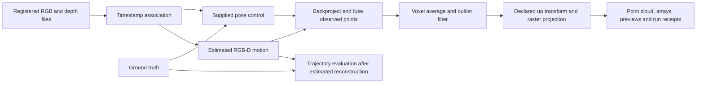

# Architecture

This is an offline desktop experiment for turning observed surfaces into maps. It supports FYLD's exploration of phone footage from construction and utility sites. It does not identify buried assets, infer free space, or establish survey accuracy.

## Implemented Phase 1

Python 3.11 is the preferred environment; Python 3.12 was used for the local validation. NumPy and Open3D run on the CPU. The reusable package is `src/fyld_scene_mapping`. Root scripts keep editable settings in `main()` rather than command-line argument parsing.

| Responsibility | Existing module |
|---|---|
| Bounded download, extraction and hashes | `acquisition.py` |
| RGB/depth association and separate ground-truth association | `datasets.py` |
| Intrinsics, metric depth, rigid transforms and plane alignment | `geometry.py` |
| Hybrid RGB-D odometry, quality gates and point fusion | `reconstruction.py` |
| Observed surface raster projection | `mapping.py` |
| Rigid trajectory evaluation | `evaluation.py` |
| Run orchestration and export | `experiments.py`, `reporting.py` |
| Software and hardware receipt | `environment.py` |

The supplied-pose control uses the inverse of the first ground-truth pose to place geometry in the first camera frame. The estimated branch starts at identity and receives no ground-truth poses. It estimates adjacent-frame motion using Open3D's hybrid RGB-D term. There is no loop closure. A failed quality gate or excessive timestamp gap stops reconstruction at the first break; later frames are not joined across it.

Fusion averages samples within 1.5 cm voxels, then removes statistical outliers. Projection defaults to 2 cm cells. Cell size is a sampling choice, not an accuracy result. The default height is the maximum retained height. Colour comes from the highest retained sample. Minimum, maximum and vertical-range arrays preserve other observed height information. Counts describe retained voxel centres, not independent observations or confidence. Unknown heights remain NaN.

Every completed run exports geometry, map arrays, display images, trajectory, settings, source hashes, timing and environment information. Inspect its manifest before comparing results. Ground-truth trajectory agreement does not measure reconstructed surface accuracy.

## Five-phase sequence

| Phase | Deliverable | Decision before proceeding |
|---|---|---|
| 1 | Desktop RGB-D control and estimated-pose experiment | Reproduce outputs and expose failure/unknown regions |
| 2 | Representative phone recordings | Determine whether safe footage has sufficient overlap, calibration and metric reference |
| 3 | Phone-to-PC processing proposal | Replay recordings reliably before streaming |
| 4 | Hosted processing proposal | Measure queue, memory and cost under representative load |
| 5 | Mobile execution proposal | Meet measured quality, latency, battery and thermal goals on supported phones |

The requested filenames `phase2_backend.md`, `phase3_hosting.md` and `phase4_mobile_edge.md` are retained for compatibility. Their contents describe Phases 3, 4 and 5 respectively. Only Phase 1 is implemented. The later proposals should reuse the package through adapters for capture, calibration and job execution. They should not create a second geometry pipeline.
