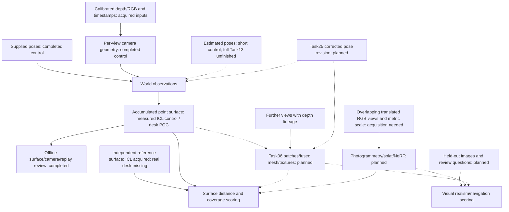

# Experiment 04: surface reconstruction

## Implemented CPU baseline

The supplied-depth baseline builds an observed surface as one coloured point file per selected frame. Every valid pixel retains its source frame, pixel position and supplied camera pose. Evaluation measures exact nearest-reference distance and the fraction of all published reference vertices within an explicit distance of any observed point. No tracking or depth prediction is involved.

The [completed nine-frame CPU review](runs/20261002T145103.184769Z_000165ef2e044376baf54b675172a64e/review.html) contains matching inputs, depth, error images, individual point files and the accumulated surface preview. It is local generated output, absent from a fresh clone. All 273 artifacts and 68 review links validate. Copied originals match the dataset, and every numerical stage and PLY point was checked against the supplied geometry.

| Measurement | Result |
|---|---|
| Selected IDs | 1, 101, 201, 301, 401, 501, 601, 701, 801 |
| Observed points | 2,732,193; every valid pixel retained |
| Mean distance to reference | 7.847 mm |
| Root mean squared distance | 9.157 mm |
| Maximum distance | 31.501 mm |
| Whole reference within 50 mm | 2,225,143 of 9,982,296 vertices, or 22.291% |
| Observed points within 50 mm | 100% |
| CPU geometry | 0.122 seconds |
| Exact whole-reference scoring | 171.036 seconds |
| Full-point preview | 18.448 seconds |
| Total computation before publication | 197.431 seconds |
| Peak desktop process memory | 1,648,340,992 bytes; includes joined cloud, scorer and preview |
| Point-file representation size | 73,770,858 bytes |

The numerical score and the inspected preview agree: observed room surfaces are close to the reference, with gaps where selected views supply no valid geometry. Frame 501 excludes 22,990 invalid pixels and frame 601 excludes 9,617. Coverage is for the whole reference, including unseen room regions. This establishes a supplied-input point-surface baseline, not phone performance, tracking accuracy or fused-mesh quality.

An initial sequential CPU run stopped after seven frames without a completion manifest. A second run rebuilt all nine frames and performed one exact reverse query against their joined cloud. It took about 3.3 minutes. The final publication preserves those verified numerical outputs and corrects how earlier fault summaries are labelled; source computation timing remains in `metrics.json`, with copying/publication timing recorded separately. Earlier directories remain intact. Fault summaries from the incomplete run are diagnostic records only and are excluded from the completed measurements. Independent analytic tests verify that incorrect scale and pose direction worsen error. Those dataset fault queries were not repeated for this publication.

Install the [CPU requirements](requirements.txt), then run from the repository root:

```powershell
python -m pip install -r experiments/04_surface_reconstruction/requirements.txt
python -B tools/check.py
python -B -m experiments.04_surface_reconstruction.src.run --dataset data/icl_nuim --frame-ids <explicit IDs> --threshold-m <reporting distance in metres>
```

Selection and distance are required arguments. There is no implicit stride, frame cap, depth clipping, filtering, voxel size or acceptance limit. The inspected run uses the nine IDs above with a 0.05 m reporting distance, authorised on 2 October 2026. All execution is CPU-only. Every GPU run needs separate permission. The sequential command above performs full per-frame reverse scoring and distant fault queries; these can take hours. For a small repeat inspection from the saved completed run, use the equivalent desktop batch scorer:

```powershell
python -B -m experiments.04_surface_reconstruction.src.inspection --dataset data/icl_nuim --frame-ids 1 101 201 301 401 501 601 701 801 --threshold-m 0.05 --recover-run experiments/04_surface_reconstruction/runs/20261002T145103.184769Z_000165ef2e044376baf54b675172a64e
```

Recovery requires matching inputs, reference, settings and scoring code. Completed prior records must pass manifest verification; each reused score record must match the captured manifest hash, and the prior is verified again before publication. Incomplete prior fault summaries are excluded. Normal geometry and surface distances are recomputed. A later code or dependency change can require a fresh control instead of recovery.

| Module | Responsibility |
|---|---|
| `src/dataset.py` | Hash-checked copies, exact-ID ICL adapter, strict binary reference loading |
| `src/backend.py` | Supplied-depth geometry and common-origin guard; receives no reference |
| `src/evaluation.py` | Exact distances in both directions and global reference-point coverage |
| `src/export.py` | Lossless per-frame arrays, binary coloured PLY files and pixel diagnostics |
| `src/run.py` | Explicit configuration, separate evaluation input, timing, memory and publication |
| `src/inspection.py` | Desktop batch scoring, full-point overview and reviewed republication |
| `src/recovery.py` | Matching inputs/code/settings and immutable verified score-record checks |
| `src/review.py` | HTML review of matching inputs, scores and their limits |

Each unique run copies originals into `input/<frame-id>/`, decoder metadata into `input/dataset/`, and the separate reference into `input/evaluation/`. `output/<frame-id>/` retains depth, validity, pixel positions, camera/world/reference points, colours, projection residuals, reference distances and `surface.ply`. `output/surface.json` indexes the accumulated surface as these point files. It does not merge repeated observations or fill holes. `output/metrics.json` holds scores, timing, representation size, memory and any verified fault checks; unmeasured controls are null. `output/reference_distance.npy` stores nearest observed distance for each reference vertex in original file order. Debug images show depth, validity and per-pixel distance, with scales in `legends.json`. Open `review.html` to inspect the run.

Observed-point error is weighted by observations, so duplicate views count repeatedly. Coverage is weighted by published reference vertices, not surface area. Whole-reference coverage includes regions the chosen frames never see; it must not be called visible-region completeness. No fitted transform or scale is applied. Distance measures proximity to discrete reference points, not to a continuous mesh. The reporting distance is not a product accuracy requirement.

The reconstruction backend processes one frame at a time. The sequential scorer also updates coverage frame by frame; the faster desktop inspection joins selected points for its final coverage query and preview, so that evaluator's memory grows with selected-frame count. Both hold the reference and its search index. Neither desktop memory nor timing establishes mobile performance. Windows receipts record the process's lifetime peak working set and end-of-run resident memory, including scoring and preview. On other platforms the peak field is null if unavailable. The backend uses the ICL Frame adapter and checked geometry; a phone adapter must supply equivalent metric observations before reuse. Mobile viability remains untested.

Tests independently specify translated points, prove depth doubling and inverse poses worsen distance, and show that removing the only observations of a reference patch halves coverage. They also cover duplicate views, exact distance boundaries, invalid inputs, empty geometry, origin resets, truncated PLYs, copied originals, tampering and failed runs. Failed runs retain a failed receipt; abrupt termination can leave running status. `experiments.shared.runs.verify_run` rejects incomplete or modified runs. Restart uses a new directory. CPU Open3D fusion remains a separately configured comparison after the direct baseline.

## Shared implementation available

The [task 03 control](../geometry_validation/README.md#implemented-geometry-control) exports supplied-depth/supplied-pose geometry one frame at a time. This baseline reuses its checked geometry and [shared records and publication](../shared/README.md). Every reconstruction run uses `runs/<unique-id>/{input,output,debug,metadata}/`, matching artifacts to source frame IDs.

The camera-to-world pose contains a proper rotation. The publisher reference conversion includes a reflection and cannot be supplied as a camera pose. For an Open3D integrator that accepts world-to-camera extrinsics, invert the camera pose explicitly and verify it against the control. Preserve raw depth, validity and per-input coordinate outputs when adding GPU fusion. Backend placement must not change these meanings. Ask the user before every GPU run.

## Flow and implementation boundary

[Stage 03](../03_camera_pose_estimation/README.md) estimates camera rotation and translation. This stage accepts those poses, or supplied reference poses for its independent control, together with depth and calibration. Convert depth to camera points, place observations in a declared world, then accumulate or integrate them into an observed surface. Surface accuracy is evaluated separately from camera trajectory accuracy.

Keep dataset ingestion, fusion/backend invocation, surface evaluation and run orchestration in separate modules under `src/`. Reuse shared geometry and exports. A library that returns both poses and a surface can serve both experiments, provided inputs, outputs and evaluation remain explicit. If a tracker corrects earlier poses, update affected surface contributions or rebuild the surface; record the pose revision used. Unresolved origin resets cannot be fused.

The implemented layout has `src/`, `tests/` and `runs/<unique-id>/{input,output,debug,metadata}/`. Outputs distinguish per-frame points and their accumulated index from a fused surface or finished map.

## The piece we are testing

Can depth observations and camera poses produce an accurate three-dimensional representation of visible surfaces? This piece owns reconstruction. It does not estimate depth, solve camera movement or produce a bird's-eye map.

Begin with supplied poses and depth from datasets. This needs neither a phone nor an implementation of Experiments 01–03. See the [dataset plan](../datasets/README.md). Replace one input at a time later to measure how upstream errors affect surfaces.

## Development dataset and reference

Develop against acquired clean ICL-NUIM living-room trajectory 2 at `data/icl_nuim/trajectory2/`. Use colour/depth pairs and supplied poses with matching IDs 1 through 880; preserve raw frame 0 but exclude it from supplied-pose runs because it has no pose. All 881 raw colour/depth pairs decoded successfully, and all 880 pose rows contain finite values. [Inspection receipt](../../data/icl_nuim/inspection.json).

Evaluation uses the separately acquired `data/icl_nuim/reference_surface/living-room.ply`, containing 9,982,296 reference points with colour and normals. It stays outside reconstruction inputs. Calibration, depth units and the fixed conversion are recorded in [conventions.json](../../data/icl_nuim/conventions.json). Task 03 verified geometry conventions; the nine-frame surface result above now supplies the independent score. Acquisition-time readiness flags remain historical records. No additional dataset was needed.

## Input and output agreement

Input contains timestamped depth in metres, validity masks, calibration and corresponding camera poses. Optional colour needs an explicit registration relationship. Poses map from the depth camera into a declared world frame and carry segment and frame identifiers. Keep unresolved tracking segments in separate reconstructions; reject fusion across origins until a recorded transform establishes the relationship. Record timestamp interpolation and rejected associations.

Output is an observed surface representation, initially a point cloud, with a fused surface or mesh as a separate comparison. Coordinates retain frame and units. Store observation provenance and processing settings. Absent surfaces remain unobserved; an attractive closed mesh does not establish measured coverage.

Known gravity or site references can be supplied. Neither follows merely because a model looks level in a viewer.

## Proposed steps and comparisons

1. Verify transforms and depth conversion with known-geometry fixtures.
2. Use ICL-NUIM living-room depth and supplied poses after checking calibration and formats.
3. Compare direct accumulation with surface fusion, recording filtering and resolution choices.
4. Evaluate against the living-room reference surface, kept outside reconstruction inputs.
5. Repeat with estimated poses and alternative depth while preserving comparable observations.

The office scene lacks the same explicit reference surface. It cannot silently substitute for the living-room geometry evaluation.

## Measurements, failures and decision

Measure surface-distance error and missing coverage separately. Report representation size, runtime, memory and changes across repeated inputs. Declare how comparable surfaces are selected; a small accurate patch cannot stand for successful reconstruction of the whole scene.

Include pose discontinuities, invalid depth, inconsistent units, contradictory observations and interruption. Decide whether processing can resume from stored inputs or must restart. Label partial results.

Agree numeric accuracy and coverage limits from the intended output before acceptance runs. Choose representations by measured geometry and consumer needs.

## Dependencies and first tasks

Use a desktop CPU control first. Candidate versions observed in the archived environment are Python3.12.10, NumPy2.4.2, Pillow12.3.0, Open3D0.19.0 and pytest9.0.2; SciPy1.17.1 can support geometry evaluation, while Matplotlib3.10.8 and psutil7.2.2 support reporting. These observations are not a verified clean-install lock. Pin a fresh working environment before running comparisons. No CUDA, learned weights or phone is needed.

The [official Open3D0.19 RGB-D integration tutorial](https://www.open3d.org/docs/0.19.0/tutorial/pipelines/rgbd_integration.html) supplies the volume-integration reference. Verify its extrinsic direction against the shared contract; do not copy settings without provenance. Direct accumulation is the simpler first control. ICL's separate reference surface is essential for measuring surface accuracy.

[Task 02: standard references](../../task_list/closed/02_verify_standard_tracking_and_reconstruction_refere.md), [Task 03: geometry contracts](../../task_list/closed/03_define_observation_and_pose_contracts_with_known_g.md) and [Task 04: reference-pose reconstruction](../../task_list/closed/04_evaluate_reconstruction_with_supplied_depth_and_po.md) are complete. [Task 05: tracking](../../task_list/closed/05_evaluate_tracking_with_supplied_benchmark_depth.md) can now supply independently evaluated estimated poses for matched comparisons.

## Research and reuse

[ICL-NUIM](../../research/sources/18_icl_nuim.md) supplies controlled surface comparison. [Open3D](../../research/sources/13_open3d_rgbd.md) informs fusion choices. [COLMAP](../../research/sources/11_colmap.md) offers an image-based comparison whose scale needs separate establishment. [Construction capture guidance](../../research/sources/19_construction_capture_guidance.md) explains viewpoint limitations.

Promote a surface agreement when Experiment 05 consumes it alongside synthetic geometry independently of the reconstructor. Check dataset, tool and weight permissions separately. Fixture results establish implementation checks, not acquired-scene accuracy. See the [experiment guide](../README.md).


## Inspecting the three-dimensional surface

The offline viewer accumulates sampled coloured points through the selected frame and displays the supplied camera orientation. Toggle the ground-truth comparison to show a separate sample from the independent reference surface in muted blue. The reconstructed coloured points are evaluated output generated from clean synthetic ground-truth depth and poses. The distance images are evaluated output: distances our code calculates against that reference. They are not expected depth maps.

The viewer is a point surface, with no triangles, hole filling or duplicate fusion. Numerical arrays and full point files remain unchanged. Metadata gives separate full and display counts for reconstructed and reference points. Frame IDs have no saved capture timestamps, so stepping shows observation order rather than measured playback speed. Depth colour scales and distance scales have separate links. The static accumulated surface preview is now shown for ordinary runs too.

[Open the verified labelled 3D inspection](runs/20261002T195928.219822Z_55d2d0bfa455453eb2289a5e717490c1/viewer.html). This new publication preserves the numerical run and its original input files. The original computation timing and the separate visual-publication timing are both linked.

## Reconciled research boundary, 4 October 2026

The measured ICL control above remains a point-surface reconstruction with supplied depth/poses. The [desk replay](../06_object_recognition/experiments/05_replay/README.md) also accumulates measured points using supplied TUM poses, but has no acquired independent dense reference surface. Its visual coverage cannot inherit ICL's accuracy score. [Task36](../../task_list/open/36_compare_surface_representations_and_visual_realism.md) owns new points/patches/mesh/texture/photogrammetry/splat/NeRF comparisons. [Task35](../../task_list/open/35_measure_error_propagation_and_sequential_fusion.md) owns error/fusion/correction assessment; Task25 owns later camera corrections. Task23's partial viewer work remains unfinished and is preserved.



Geometry proximity, observed coverage, missing/false surfaces and cost are separate from visual realism. Full-object dimensions need independent references and adequate surface coverage. Densifying display changes presentation, not captured information. No representation or correction experiment was started in documentation Task30.
