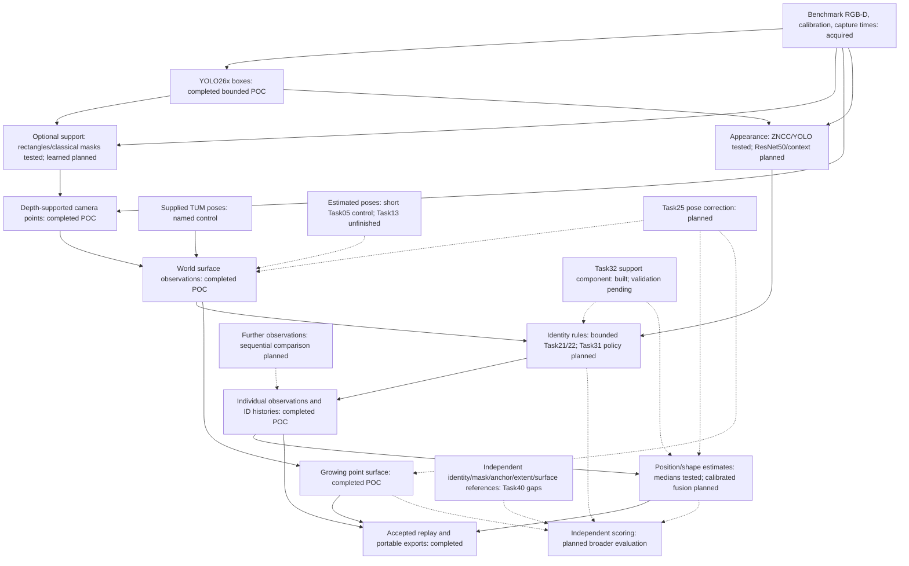

# Layer 5: object isolation and counting

This folder (experiment 06) is layer 5 of the five-layer pipeline described in the [root README](../../README.md). It answers: **which objects are in the scene, where are they in 3D, and how many distinct ones are there, even when one leaves the camera view and comes back?**

This is the brief's object-counting problem. Counting detections in 2D video over-counts, because a cone that leaves the frame and returns looks like a new cone. Giving each object a 3D position, using depth (layer 2) and the camera path (layer 3), lets a returning object be matched to the one already counted. The brief also notes that SAM, Meta's segmentation model, works but is heavy; this layer tests where cheaper steps are good enough.

**Status:** early trial on recorded indoor desk video, using the benchmark's reference camera path. Detection, masks, appearance matching and identity rules have each been tried on a small reviewed set, and a 60-frame replay processed 457 detections. There is no blind, human-checked test yet. Results are in [What is established](#what-is-established) below.

## How object isolation works

The layer is a chain. Each step can be swapped independently.

1. **Detection.** A neural network draws a box round each object it recognises, with a class name and a confidence score. A *closed-set* detector, such as YOLO or RF-DETR, knows a fixed list of classes; the common COCO list has 80 everyday classes and no traffic cones or barriers, so site objects need fine-tuning. An *open-vocabulary* detector, such as Grounding DINO or SAM 3, finds objects named in plain text instead.
2. **Segmentation.** Pick out the object's own pixels inside the box. This matters because depth read from the whole box includes the wall behind the object, which pulls its 3D position backwards. Classical methods (GrabCut, filled outlines) need no model. Learned methods are the SAM family: SAM and SAM 2 outline whatever a box or point points at, SAM 2 follows it through video, and SAM 3 finds every instance of a named concept. Small versions (MobileSAM, EdgeSAM, EfficientSAM) trade some quality for speed.
3. **3D placement.** Take the depth at the object's pixels, convert to a 3D point in the camera's frame, then move it into the world with the camera pose. The result is a point on the object's *visible surface*. It moves as the camera moves round the object, so it is not the object's centre.
4. **Appearance similarity.** Describe how the object looks so two sightings can be compared. Options range from comparing image patches directly (template matching, ZNCC), through distinctive-spot matching (ORB, SIFT), to learned descriptions (DINOv2, ResNet). Appearance helps when positions are uncertain. It cannot separate two identical objects.
5. **Association.** Decide, for each new sighting, which known object it is, or that it is new.
   - *Short-term tracking*, such as ByteTrack, links boxes between consecutive frames by overlap and motion. It drops an object after it has been out of view for a while, so it cannot handle long absences.
   - *Persistent identity* keeps a record for every object: 3D position, size, appearance and every sighting. A new sighting is matched to records by position and appearance, one-to-one within a frame (the Hungarian algorithm), with "new object" always an allowed answer. ConceptGraphs is a research system built this way.
6. **Counting.** Count object records, not detections. An unmatched sighting first becomes a *provisional* object until more evidence confirms it. Duplicates, missed objects and wrong merges are reported separately, because a correct total can hide one duplicate and one miss.

**Why SAM on every frame should not be needed.** Detection plus 3D position does most of the identity work. Outlines matter mainly where background depth pollutes an object's position. So the efficient design runs a small detector, adds masks only on chosen frames or tricky objects, and measures whether the masks change the answer. Running detection on a subset of frames rather than all 30 per second is another saving to test. Every step's cost is recorded separately so this can be decided with numbers.

## Methods: hosted and on the phone

| Method | Route | What it does | Licence and notes |
|---|---|---|---|
| [SAM 3](https://arxiv.org/abs/2511.16719) | Hosted | Finds, outlines and follows every instance of a text-named object through video | Meta's SAM licence; check terms. Heavy; GPU server. |
| [Grounding DINO](https://arxiv.org/abs/2303.05499) + [SAM 2](https://arxiv.org/abs/2408.00714) | Hosted | Text-prompted boxes, then outlines followed through video | Both Apache-2.0. |
| [YOLO26](https://docs.ultralytics.com/models/yolo26) x | Hosted | Closed-set detector. The YOLO26x checkpoint is the one used in the trials so far. | AGPL-3.0 or a paid enterprise licence. |
| [RF-DETR](https://github.com/roboflow/rf-detr) | Either | Closed-set detector, sizes from Nano to 2x-large | Apache-2.0 for Nano to Large. The project research ranks Nano first for the next detector comparison. |
| [DINOv2](https://github.com/facebookresearch/dinov2) / [DINOv3](https://arxiv.org/abs/2508.10104) | Hosted, or small variant on the phone | Appearance descriptions for matching sightings | DINOv2 Apache-2.0 (ViT-S/14 has 21 million parameters); DINOv3 has its own licence. |
| [ConceptGraphs](https://concept-graphs.github.io/) | Hosted | A 3D map of individual objects from posed colour and depth | Research code; check terms. A design reference for persistent counting. |
| [BoT-SORT](https://github.com/NirAharon/BoT-SORT) | Hosted | Short-term tracking with camera-motion compensation and appearance | Check terms. |
| [ByteTrack](https://github.com/ifzhang/ByteTrack) | On the phone | Light short-term tracking from boxes alone | MIT. |
| ARCore pose and depth | On the phone | Places each detection in 3D live, so a returning object can be matched on site | Both test phones are ARCore-supported; accuracy unmeasured. |
| [MobileSAM](https://github.com/ChaoningZhang/MobileSAM), [EdgeSAM](https://github.com/chongzhou96/EdgeSAM), [EfficientSAM](https://github.com/yformer/EfficientSAM) | On the phone, chosen frames only | Small prompted outline models | MobileSAM and EfficientSAM Apache-2.0; EdgeSAM uses the NTU S-Lab licence. EdgeSAM's authors report 38.7 frames per second on an iPhone 14. |
| OpenCV GrabCut and contours | Either | Classical outlines from a box, no model | Apache-2.0. Already tested here. |

Phone models run through [LiteRT](https://ai.google.dev/edge/litert), [ONNX Runtime Mobile](https://onnxruntime.ai/docs/tutorials/mobile/), [ExecuTorch](https://pytorch.org/executorch) or [Qualcomm AI Hub](https://aihub.qualcomm.com/). None has been timed on the test phones. Published speeds come from the authors' hardware.

## Top 5 sources

| Source | What it is | Why it matters here |
|---|---|---|
| [SAM 3](https://arxiv.org/abs/2511.16719) | Segment Anything with Concepts (ICLR 2026) | Finds, outlines and keeps identities for named objects in video. The strongest hosted option, and the benchmark for "is SAM needed". |
| [RF-DETR](https://arxiv.org/abs/2511.09554) | Real-time detection transformer (ICLR 2026) | A permissively licensed small detector for the phone route and for fine-tuning on site objects. |
| [ConceptGraphs](https://arxiv.org/abs/2309.16650) | 3D object maps from posed colour and depth | The closest published design to persistent 3D counting. |
| [ByteTrack](https://arxiv.org/abs/2110.06864) | Short-term multi-object tracking | The light frame-to-frame tracker; shows why short-term tracks alone re-count returning objects. |
| [DINOv2](https://arxiv.org/abs/2304.07193) | Self-supervised image features | The main learned option for comparing object appearance across views. |

More background: [mobile mapping and counting review](../../research/edge_products/README.md), [Fusion++](https://arxiv.org/abs/1808.08378) for persistent object maps, [Deep SORT](https://arxiv.org/abs/1703.07402), and the [ranked model shortlist](../../research/README.md#ranked-shortlist) with versions and licences.

## What can be improved

- **Softer identity rule.** The current rule blocks a second object of the same class, which left 90 of 95 book detections unassigned. Compare it with provisional identities and recorded possible duplicates.
- **Independent references.** Hand-checked identities and masks, surveyed object positions and sizes, and a blind test set. Without them, none of the comparisons below can be scored.
- **Site object classes.** Fine-tune a detector on cones, barriers, pipes and plant, or test open-vocabulary detection, on worksite footage.
- **Is segmentation useful at all?** Measure whether outlines make positions more accurate against surveyed positions, not just different. Compare plain boxes, classical masks and hand-checked masks first, then learned masks starting with the SAM family (SAM 2 and SAM 3 on a server, MobileSAM or EdgeSAM for phone cost).
- **SAM 3 as a counting baseline.** Run SAM 3 end to end on the same clips, using its own video identities, and compare its counts with the 3D identity approach. If it counts returning objects correctly on short clips, the 3D machinery is only needed for longer or multi-visit captures.
- **Uncertainty.** Replace single-point positions with regions, and check that the regions contain the true position as often as they claim.
- **Appearance.** Compare template matching, detector features and DINOv2, with and without background, on the same crops.
- **Errors through the chain.** Measure how box, depth and camera-path errors add up, and whether more views of an object reduce error or repeat the same bias.
- **Real camera paths.** Repeat the replay with layer 3's tracked path instead of the reference path.
- **Moving objects.** People and vehicles need short-term tracking, kept separate from the stationary inventory.
- **Cost.** Time each step on a server and on the phones, and test detection on fewer frames.

The sections below are the detailed experiment record.

## What is established

This experiment has a bounded recorded RGB-D proof of concept with supplied camera poses. It detects objects, projects measured depth, compares appearance and identity rules, and replays source-linked observations. It has not established general object inventory accuracy, calibrated position uncertainty or phone performance.

| Owner and evidence | Completed measurement | Limits |
|---|---|---|
| [Task27 single-view xyz pilot](pilot/README.md) | One visually reviewed YOLO26x cup detection and measured depth projected into scene coordinates | Different recording from desk. No verified physical identity connecting the two cups; surface sample is not object centre. |
| [Task17 reference preparation](datasets/README.md) | Six desk RGB-D frames, three identities, eleven provisional observations | RGB-only agent review; cup coverage complete on selected frames, monitor positives non-exhaustive. No human gold/blind benchmark; masks coarse. |
| [Task18 detection](experiments/01_detection/README.md) | Cached YOLO26x finds four of five cup references and six annotated monitor positives | Coarse, inspected frames; no monitor precision/recall because reference coverage is partial. |
| [Task19 segmentation](experiments/02_segmentation/README.md) | Forty-five rectangle/GrabCut/contour masks on fifteen prompts; depth coordinate differences and desktop costs | No positional/size improvement proved; no learned mask result. |
| [Task20 appearance](experiments/03_appearance/README.md) | ZNCC: seven correct gallery rankings; existing YOLO features: six correct, one wrong monitor ranking; ORB/SIFT unavailable on recorded pairs | One cup identity cannot test separation from another cup. ResNet50 and contextual embeddings remain untested. |
| [Task21 identity](experiments/04_geometry_identity/README.md) | Five conditions on eleven provisional observations; geometry-only and combined conditions each resolve all eleven; appearance-only leaves four unresolved | Does not prove both evidence types always necessary. Task21 stays pending review. |
| [Task22 replay](experiments/05_replay/README.md) | Sixty-frame/457-proposal baseline plus six-frame/17-box automatic comparison; source-linked ID histories | Supplied poses; inspected POC. Task22 stays pending review. |

[Open the accepted Task22 viewer](experiments/05_replay/runs/20261004T152704.023370Z_84abb8b3b9594dcea8a1e5b2c8aced66/review.html). Its final publication is hash-verified; the preceding browser check and final browser-launch limitation remain in its README/receipts. Task30 did not repeat browser interaction.

[Task29 portable HTML](experiments/05_replay/runs/shareable/task22_20261004/task22_replay.html), [ZIP](experiments/05_replay/runs/shareable/task22_replay_20261004.zip), [all cup proposals](experiments/05_replay/runs/shareable/task22_20261004/cup_desk_observations.csv), [spread results](experiments/05_replay/runs/shareable/task22_20261004/cup_repeatability.json) and [plot](experiments/05_replay/runs/shareable/task22_20261004/cup_repeatability.png) preserve the accepted source publication.

Nineteen desk cup proposals include sixteen assigned, three unresolved and two without position. On the sixteen assigned observations, box-median and centre-sample RMS spread are 72.8 mm and 82.3 mm; maximum pairwise distances are 291.7 mm and 317.0 mm. These are correlated, association-selected visible-surface measurements, not absolute physical-centre accuracy. The 30.8 mm before/return difference concerns only two views.

The baseline's 95 book proposals have one new ID, four matches and 90 unresolved outside the position gate. Once an old same-class track exists, the birth policy denies new IDs to later unmatched candidates. The baseline uses geometry-only association; this does not establish failed book appearance matching. Task31 owns the explicit policy comparison.

## Current data and acquisition gaps

Freiburg1 xyz and desk provide acquired RGB-D images, calibration, timestamps and motion-capture poses. TUM depth is a measured input with holes/noise, not a predicted depth model. Reference poses are deliberately consumed by the named supplied-pose controls. Estimated-pose comparisons remain unperformed; Task13's frozen settings/full sequence are untouched.

Desk return evidence includes cup-visible frame104 at 1305031457.091655, no cup pixels in frame268 at 1305031463.059810, and return frame359 at 1305031466.095840. Twenty-seven sampled views without YOLO cup detections are not twenty-seven physically absent views. The earlier xyz gap candidate still contained the cup and is not accepted absence evidence.

Task17 freezes two enrollment and four evaluation frames, with no validation partition. These are already inspected within-session examples. Similar monitors supply a limited distinct-object case. Controlled lighting/rotation, moved objects, full-occlusion recovery, identical objects in disjoint views, new sessions, phone capture and origin resets require additional evidence. TUM has no acquired independent dense surface or surveyed desk-object centres; ICL's synthetic surface score cannot be transferred to this replay.

The existing adapter retains positive depth below 4 m. Missing or excluded depth means unknown position. Longer-range indoor/outdoor claims need a new independently assessed data/adapter condition, not a silent cutoff change.

## Implemented ownership

The following folders exist and have bounded results; their contents are not still a proposed scaffold.

```text
06_object_recognition/
  src/identity_store.py            checked decisions and atomic persistence
  shared/                         observation, manifest and pose-revision contracts
  datasets/                       frozen provisional desk reference and preparation
  pilot/                          single-view xyz mapping and 60-frame desk replay
  experiments/
    01_detection/                 cached detector scoring
    02_segmentation/              classical support comparison
    03_appearance/                ZNCC/local features/existing YOLO embeddings
    04_geometry_identity/         supplied-input identity comparisons
    05_replay/                    synchronized viewer and portable evidence
```

Reuse the [existing checked identity store](src/identity_store.py), [shared object agreements](shared/README.md) and [common geometry/run contracts](../shared/README.md). Do not introduce a second identity database, camera tracker or geometry library. The pose-revision sidecar contract exists; production of corrected camera paths and committed downstream rebuilds remains later work. Task25 owns camera comparison/correction after Task13; Task35 investigates its effect on object/surface estimates.

## Intended identity behaviour

Every detection retains a unique observation ID and immutable source evidence, including rejected and positionless detections. An unmatched plausible candidate can receive a provisional object ID. Possible duplicates remain explicit relationships until evidence supports unification; unification preserves both ID histories, aliases and decision provenance. A confident returning observation retains the existing object ID.

Provisional candidates, confirmed inventory and rejected detections are separate states. A detector class/score or first ID does not by itself confirm a physical object. Missing depth means unknown position, not an invented location or automatic rejection of all appearance evidence. Unknown world relationships cannot justify metric merging.

Use one-to-one assignment within a view, with an explicit unmatched option. Distinct independently checked foreground supports visible together constrain separate objects; overlapping duplicate boxes alone do not. Identical objects seen only in separate views can remain ambiguous. Task31 will compare this behaviour against the existing restrictive policy rather than silently modifying the completed baseline.

## Evidence flow and future replacements

Solid arrows are exercised paths; dashed arrows are planned comparisons or correction/evaluation additions.



Uncertainty about an anchor, geometry of its visible surface and hypotheses about complete dimensions are different records. Detector confidence, cosine scores and raw point spread are not calibrated probabilities. Task32 now has a reusable descriptive support component at `experiments/06_object_recognition/experiments/04_geometry_identity/spatial_support.py`: it summarises finite 3D samples with a regularised covariance and exposes Mahalanobis distance only when its minimum sample guard is met. It does not change current association, claim calibrated uncertainty or select a matching threshold. Validation of whether this representation helps belongs to the parallel evaluation work.

## Scoped next investigations

The [task board](../../task_list/README.md#next-experiment-order-and-gaps) owns priorities and dependencies. [Research coverage](../../research/README.md#research-agenda-4-october-2026) provides sources and platform distinctions.

| Workstream | Owner | Isolated comparison and decision |
|---|---|---|
| A: IDs and possible duplicates | Task31 | Restrictive births versus provisional candidates, one-to-one matching and explicit duplicate relationships; decide auditable inventory behaviour |
| B: Spatial uncertainty | Task32 | Centre gates versus spatial supports/distributions with checked masks/poses; decide whether claimed uncertainty predicts independent errors |
| C: Appearance/spatial association | Task33 | ZNCC/current YOLO/proposed ResNet50/context; object-only versus context, then spatial/appearance ablations; decide evidence/cost trade-offs |
| D: Segmentation/position/size | Task34 | Rectangles/classical/independently checked masks, learned methods only when authorised; decide if masks improve error or just change samples |
| E: Error and sequential fusion | Task35 | Separate pixel/depth/calibration/pose perturbations, then combined; single view versus growing estimates; decide when extra views help or reinforce bias |
| F: Surface display/reconstruction | Task36 | Points, patches, fused/textured meshes, photogrammetry, Gaussian/NeRF; score geometry separately from realism |
| G: AR/VR room mapping | Task37 | ARCore data/API capability; Apple LiDAR controls only with hardware access; decide transferable capture/correction/revisit techniques |
| H: Driving/longer range | Task38 | Research camera/stereo/LiDAR and stationary versus moving-object evaluation; decide data/sensor acquisition |
| I: Later review/measurement application | Task39 | Requirements only: 3D pick-to-source histories and measurement displays; decide review workflow separately from accuracy |
| Shared independent references | Task40 | Design/acquire checked identities/masks, physical anchors/extents/surfaces and new-session hard cases after owner authorisation |

No follow-up runs in Task30. Completed Tasks17-20/27-29 remain historical evidence. Task09 remains the inventory umbrella; Task16/21/22 remain pending review. Tasks23/24 retain their unfinished review/build scopes, and Task25 remains behind Task13.

## Proposed comparison protocol

Task16's [broader shortlist/protocol](../../task_list/pending_review/16_research_segmentation_recognition_and_camera_corre.md) remains pending review. Its RF-DETR/YOLO nano, compact learned masks, DINO and camera-loop comparisons were not all executed. The [research shortlist](../../research/README.md#ranked-shortlist) is a dated source review, not a new model acquisition instruction. ResNet50 is an additional proposed appearance control, not a Task20 result.

Freeze source-session splits before tuning. Keep nearby frames, derivatives and augmentations together. Independent human-checked labels/reference measurements score the methods after predictions; an independently checked foreground mask used as a method input is an explicitly labelled oracle control. Use separate validation and held-out sessions for threshold selection and calibration. A single inspected session supports only a narrow descriptive claim.

Start with stationary objects and supplied poses. Compare rectangle and foreground supports without changing depth/poses; compare spatial models without changing appearance; compare appearance on fixed crops/supports before mixing it with geometry. Introduce estimated depth/poses and pose corrections as separate conditions. Similarity used to nominate a camera correction cannot also be independent evidence confirming the same match.

Report false merges, splits, duplicates, unresolved cases, missed objects, return recovery and inventory precision/recall separately. For time-local moving tracks, report tracking metrics separately from persistent stationary inventory. Report absolute anchor error, visible-surface repeatability and complete-object size error only when their respective independent references exist.

Current 0.35 m position and 0.80 cosine gates and equal combined-cost weights are exploratory inherited settings. They are not validated operating rules. Future settings, resource caps and decision thresholds require the owning task's recorded review/authorisation; no threshold is selected in this documentation session.

## Costs, corrections and limitations

Record model loading/warmup separately from feature/inference calls, depth selection/projection, assignment, persistence, robust fusion, pose correction/rebuild, evaluation and verified publication. Include full run cost, failures, acquisition/annotation labour, peak host/device memory and storage. Task20's recorded timings include GPU warmup; Task19's desktop totals are not repeat-benchmarked mobile results.

Retain original observations/pose revisions. Corrected poses must recompute or invalidate affected world observations, object estimates and surfaces in a new committed generation. Interrupted corrections cannot mix revisions; original runs and ID histories remain readable. These are proposed downstream guarantees, not a completed correction experiment.

Phone capture/energy/thermal behaviour, construction-site accuracy and longer-range operation remain untested. No packages, weights, inference, training, full Task13 sequence or experiment-code changes are part of Task30.
