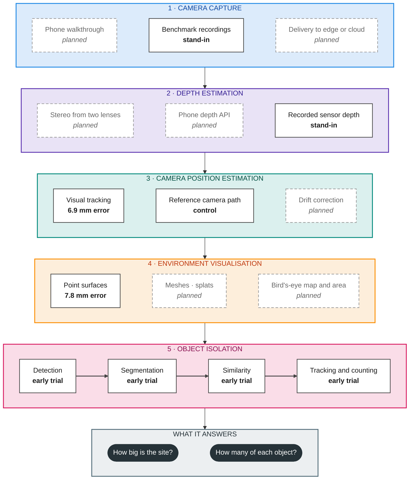

# Experiments: the five layers

The project is built as five layers, each tested on its own with known inputs before being connected. The [root README](../README.md) explains the problem, the layers, the hosted-versus-phone options and the results in plain terms. This guide covers how the experiment folders are organised, the rules every experiment follows, and how the layers connect.

| Layer | Folder | What it answers | Status |
|---|---|---|---|
| 🟦 1. Camera capture | [01_camera_capture_delivery](01_camera_capture_delivery/README.md) | Can a phone record what the other layers need and deliver it? | Redmi capability export verified; image capture still missing |
| 🟪 2. Depth estimation | [02_stereo_depth](02_stereo_depth/README.md) | How far away is each pixel, in metres? | Test data ready; no method run |
| 🟩 3. Camera position estimation | [03_camera_pose_estimation](03_camera_pose_estimation/README.md) | Where was the camera for each frame? | 30-frame trial: 6.9 mm error |
| 🟧 4. Environment visualisation | [04_surface_reconstruction](04_surface_reconstruction/README.md) and [05_birds_eye_mapping](05_birds_eye_mapping/README.md) | What does the site look like in 3D, and how big is it? | Point surface: 7.8 mm error; top-down map planned |
| 🟥 5. Object isolation | [06_object_recognition](06_object_recognition/README.md) | Which objects are there, where, and how many distinct ones? | Early trials and a 60-frame replay |
| Support | [geometry_validation](geometry_validation/README.md), [shared](shared/README.md), [datasets](datasets/README.md) | Coordinate checks, shared records and run export, test data guidance | In use |

Each layer README starts with a guide: how the layer works from first principles, hosted and on-phone method options with licences, its top 5 sources and what can be improved. The detailed experiment record follows.

Folder numbers are experiment numbers, not layer numbers: layer 4 has two folders, so the object layer is folder 06. Work-task numbers in the records below are a third, separate numbering used by the project's task tracker.

## Implementation and inspectable runs

Task 03 implements the first geometry control in [geometry validation source](geometry_validation/src/) and reusable [shared modules](shared/README.md). Each experiment owns `src/`, `tests/` and `runs/`. Each run owns `input/`, `output/`, `debug/` and `metadata/`, with stable input identifiers connecting the folders. Save every distinct numerical stage together with its diagnostic visuals. Original input bytes, exact ordered selection, settings/provenance, timings, implementation version, dirty source snapshots, dependency/hardware records and artifact hashes support reproduction. Publish completion only after artifacts validate. Generated runs stay local and outside Git.

Keep mathematics, dataset handling, estimator/backend adapters and exports separate. Begin estimator comparisons on GPU where appropriate, while retaining an array/record boundary usable by edge or hosted implementations. Ask the user before each GPU run; the initial geometry control and tests use CPU only. [Geometry control implementation and usage](geometry_validation/README.md#implemented-geometry-control) explains the first concrete run format.

The objective is to find out whether a phone capture can produce a repeatable, measurable representation of the visible work area and identify distinct objects across repeated views. We will build and evaluate six pieces independently, then connect them. The first prototype is preserved in [the Task 00 archive](../archive/task00_prototype/README.md).

The six pieces are camera capture and delivery, stereo depth, camera tracking, 3D reconstruction, bird's-eye mapping and object recognition with persistent counting. 3D reconstruction and bird's-eye mapping together make up layer 4, environment visualisation, so six experiment folders cover five layers. Capture and delivery share one experiment because the first practical question is whether useful camera observations can reach an experiment. Its camera tests and network tests still have separate measurements.

## The pieces

| Piece and plan | Takes in | Produces | Independent test |
|---|---|---|---|
| [01: Camera capture and delivery](01_camera_capture_delivery/README.md) | Selected phone, camera settings and recording request | Images with camera identity, capture times and available calibration; delivery records | Inspect saved phone captures; replay known files to test delivery separately |
| [02: Stereo depth](02_stereo_depth/README.md) | Paired images and stereo calibration | Depth in metres, valid-pixel mask and confidence if the method supplies it | Recorded calibrated stereo and reference disparities; no phone or tracking required |
| [03: Camera pose estimation](03_camera_pose_estimation/README.md) | Images, calibration, time and optional depth or motion-sensor readings | Camera positions and orientations, tracking status | Dataset observations with held-out reference poses; no stereo implementation required |
| [04: Surface reconstruction](04_surface_reconstruction/README.md) | Depth observations, camera poses and calibration | Observed scene geometry and observation evidence | Supplied depth and exact poses against a separate reference surface; no tracker required |
| [05: Bird's-eye mapping](05_birds_eye_mapping/README.md) | Geometry, a declared reference plane and selected region | Top-down views, heights, observed coverage and defined area measurements | Analytic shapes with known heights, boundaries and holes; no reconstruction required |
| [06: Object recognition and counting](06_object_recognition/README.md) | Images, optional depth/poses and prior object observations | Object labels, persistent identities, supporting views and distinct counts | Checked detections and known poses first; separately labelled revisits and inventory |

The [dataset guide](datasets/README.md) explains suitable recorded inputs, references, permissions and download status. The [research reading guide](../research/sources/README.md) explains the underlying methods.

## Folder structure and processing flow

```text
experiments/
  shared/                         geometry, portable records and run exporting
  geometry_validation/            supplied-depth/supplied-pose control
    src/                          dataset adapter, control, review and scene views
    tests/
    runs/<unique-id>/             input/, output/, debug/, metadata/, review.html
  01_camera_capture_delivery/
  02_stereo_depth/
  03_camera_pose_estimation/       camera position and orientation estimation
  04_surface_reconstruction/      combine depth observations into surfaces
  05_birds_eye_mapping/
  06_object_recognition/
  datasets/                       acquisition and recorded-input guidance
```

The geometry control is implemented. Stage 03 has a short CPU camera-tracking baseline; stage 04 has a supplied-input point-surface baseline. Their source, tests and local runs exist. Work-task IDs describe pieces of work, while experiment numbers describe pipeline stages. Work task 03 delivered geometry validation; work task 05 delivered the first pipeline stage 03 baseline.

Each coloured block is one layer. Solid boxes work today; dashed boxes are planned. "Stand-in" and "control" mean a known-correct input from benchmark data used in place of a layer that is not built yet.



Each layer can use the output of any layer above it. The object layer uses images, depth and camera positions directly, and its objects sit in the same 3D space as the layer 4 model. Inside each experiment, benchmark depth and reference camera paths stand in for unfinished layers, so every layer can be tested alone. Camera-path corrections, when they arrive, must flow down to every surface and object position built from the old path.

Depth is optional for some camera estimators. Supplied benchmark depth and poses allow each stage to be tested independently. Geometry validation supports stages 03 and 04 through shared coordinate conventions; it is a control, rather than an extra estimation stage. Object tracking means retaining object identity across observations; camera tracking means estimating camera motion.

## Established backends inside these boundaries

A complete SLAM implementation, which estimates camera motion and maintains a map, can be used inside stage 03. For example, [ORB-SLAM3](https://github.com/UZ-SLAMLab/ORB_SLAM3) provides matching, pose estimation, map optimisation, recovery and correction when revisiting a place. Its visual-landmark map overlaps with mapping, but does not itself establish the dense measured surfaces or object inventory required here. [Open3D depth integration](https://www.open3d.org/docs/0.19.0/tutorial/pipelines/rgbd_integration.html) shows how depth and camera poses can separately produce a surface. No ORB-SLAM3 backend has been installed or validated by these controls.

An implementation that supplies both poses and dense surfaces may serve stages 03 and 04 through one adapter. Keep their outputs and independent evaluation separate. We are defining reviewable experiment boundaries, not requiring every stage to be a separate process or rebuilding a package's internals.

The benefit is being able to swap backends and isolate depth, motion and reconstruction errors using known inputs. The cost is adapters and integration. Revised historical poses require affected surfaces to be updated or rebuilt. Tracking resets require explicit segment/world identities. Preserve those records whether computation runs on a phone, an edge computer or a hosted backend.

## Development data coverage

Each experiment README names its initial inputs and independent reference. Current coverage reconciled on 4 October 2026 is:

| Experiment | Development inputs | Independent reference | Readiness |
| --- | --- | --- | --- |
| Camera capture and delivery | Redmi capability export; S23 availability unconfirmed; acquired Middlebury images for file delivery replay | Actual device capability/timing records; original file hashes and frame identifiers for delivery | Warm-built Camera2 app ran on Redmi; valid report exposes rear/front IDs with no concurrent sets. Original image capture and delivery replay tests remain outstanding |
| Stereo depth | Acquired Middlebury quarter-resolution training pairs | Published disparity, masks and scene calibration | Data ready; choose development/held-out scenes before tuning |
| Camera tracking | Acquired TUM Freiburg1 xyz colour/depth | Motion-capture poses kept outside tracker inputs | 30-frame CPU trial completed: 6.93 mm position error and 2.14 image pairs/s; full xyz and selected desk evaluation remain |
| Reconstruction | Acquired ICL living-room trajectory 2 depth/poses, matched IDs 1..880 | Separate acquired living-room reference point cloud | Nine-frame CPU baseline: 7.85 mm mean error, 22.29% whole-reference coverage within 5 cm |
| Bird's-eye mapping | Independently specified known shapes; acquired ICL point cloud as a later complex input | Expected dimensions, heights, areas and observation masks from fixture definitions | Known-shape fixtures must be created with the first tests |
| Object recognition and counting | Acquired TUM xyz/desk RGB-D, existing YOLO26x, six provisional desk reference frames | Agent-reviewed selected cup coverage and monitor positive subset; human mask/identity and independent physical anchors remain gaps | Bounded detection, classical masks, appearance, identity and 60-frame/457-proposal replay completed; no blind inventory accuracy |

No KITTI download is needed to begin these independent stages. Recorded car-mounted observations cannot resolve phone camera access or replace exact expected map measurements. Outdoor validation and a later comparison using stereo depth inside tracking still need suitable data; neither is claimed complete by this initial development coverage.

## Independent does not mean isolated forever

Each piece must accept saved observations or fixtures. Its first tests substitute known inputs for the earlier piece. We then replace those inputs with measured outputs from another piece and check what changes.

For example, test reconstruction first with supplied depth and reference poses. Replace the poses with estimates to measure tracking's contribution to surface error. Replace supplied depth with stereo predictions to measure depth's contribution. Do not change both at once in the first comparison.

Map projection starts from independently specified geometry. Its expected areas and heights must come from the fixture definition, not be generated by the projection code under test.

No downstream stage is required to succeed before an upstream experiment can report a useful failure. A handset that cannot expose a usable camera pair is a capture result. It is not evidence that the stereo algorithm fails.

## Where a piece runs is a separate choice

Stereo depth can run on a phone, a desktop or a hosted backend while accepting the same kind of observation. Recorded processing is the first control; live streaming is an additional condition. Hosting and HTTP are not required to evaluate stereo depth.

Possible later assemblies include:

- Phone capture → phone depth → desktop or backend tracking and reconstruction.
- Phone capture → delivered stereo images → backend depth, tracking and reconstruction.
- Phone-provided depth and poses → reconstruction and map projection.

These are proposed combinations. None has been validated on the available phones. Comparing placement must include delivery delay and data volume as well as algorithm processing time.

## Available devices

| Device reported by the user | What is established | First checks |
|---|---|---|
| Samsung S23 | Availability not confirmed | If available, record exact model identifier, operating-system version, exposed physical cameras and simultaneous stream support |
| Redmi Note 11 Pro 4G, model 2201116TG | Report confirms Android 13/API 33, camera permission, rear/front IDs and no concurrent sets; 6 GB RAM and Helio G96 are owner-reported | Export a separate rear-camera control with its original JPEG and metadata; runtime depth and independent calibration remain unchecked |

Multiple rear lenses do not establish simultaneous access to a useful stereo pair. Android's [multi-camera documentation](https://developer.android.com/media/camera/camera2/multi-camera) makes support dependent on the device implementation and camera grouping. The first experiment records actual support on both devices. Strong internet is helpful but does not establish capture timing, sustained upload performance or camera calibration.

Task08 uses [python-for-android](https://github.com/kivy/python-for-android) for its WSL build route and a custom Java Activity that calls Camera2 directly. Its arm64 APK checks capabilities, captures a single-camera control, attempts advertised concurrent sets and exports a report ZIP. The supplied Redmi session passes export validation but contains no images. ARCore depth and pose are skipped because the SDK is absent, not because the handset is proven incompatible. [Experiment 01](01_camera_capture_delivery/README.md#redmi-device-result-5-october-2026) records the actual result and next export step.

## The information pieces must exchange

The following are proposed requirements for a small shared data format. Choose the concrete schema when implementing the first producer and consumer; do not create a general framework in advance.

| Information | Required meaning |
|---|---|
| Observation identity | Session, frame and camera identifiers; source file or original observation retained |
| Capture time | Units, clock source and relationship between cameras declared; keep it distinct from arrival time |
| Camera geometry | Intrinsics for the actual image size/crop, distortion convention and relative camera pose where needed |
| Depth | Metres and declared definition, such as camera-axis distance; invalid values and valid mask explicit |
| Camera poses | Transform direction, coordinate axes, scale source, tracked/lost status and segment/world-frame identifiers explicit; unresolved origins cannot be fused together |
| Geometry | Coordinate frame, units and observed support; unseen space is not treated as empty |
| Map reference | Plane origin/axes, source of vertical direction, grid size and selected surface statistic recorded |

Confidence is method-specific unless calibrated and tested. A generic confidence number must not silently become a probability of correctness. Missing calibration or uncertain scale must be reported rather than guessed.

## What each experiment records

Every run should retain its input selection, configuration, implementation version, outputs, timings and failures. Report published paper results separately from local measurements. Retain unknown regions through depth, geometry and projection.

Start with controls and a simple baseline. Test normal inputs, boundaries and a failure condition. Keep evaluation references out of the estimated method's inputs. Separate development examples from held-out evaluation scenes before tuning; a dataset labelled training can still supply withheld local evaluation scenes.

Numeric product acceptance limits, processing budgets and tunable settings have not been selected. Agree and record them before running a comparison. A completed experiment may conclude that a method is unsuitable; completion is an evidenced decision, not a requirement for a positive result.

Per-stage accuracy against reference data is collected in one report by [experiments/evaluation](evaluation/README.md). It re-scores verified runs with each experiment's own scorer, lists every stage (unscored stages are marked unavailable with a reason), records which reference data each score used, and compares two reports stage by stage. New stage measures should report into it rather than inventing another format.

Reusable geometry, records and run exporting live in [experiments/shared](shared/README.md). Keep estimator-specific code with its experiment; promote a helper only when another experiment needs the same behaviour. The root [src placeholder](../src/README.md) does not own a second implementation.

## Build order

Experiment 01 starts with device inspection and a small recording. Experiments 02–05 can proceed without that capture using [dataset inputs and fixtures](datasets/README.md). Tracking and reconstruction are separate experiments even if a chosen library provides both; record which outputs and references are used for each question.

Connect pieces after their independent controls pass. Then run matched-input comparisons and, finally, permitted site captures. Indoor benchmark success is preparation for a site trial, not a site-performance result.

## Current status

### Priority work: reference data and geometric controls

The main implementation starts with a verified observation/pose contract and a reconstruction control with supplied poses. Without them, a distorted map cannot be attributed to tracking versus reconstruction. Check phone-camera feasibility alongside this work, without blocking the dataset control. Object association begins with checked observations and known poses, then adds detector predictions and estimated geometry separately.

| Task | Purpose | Dependency |
|---|---|---|
| [02: research and standard reference data](../task_list/closed/02_verify_standard_tracking_and_reconstruction_refere.md) | Complete: formats/permissions checked, both ICL assets acquired, held-out TUM sequence selected | None |
| [03: known-geometry contracts](../task_list/closed/03_define_observation_and_pose_contracts_with_known_g.md) | Complete: units, transforms and segments checked; CPU geometry controls exported | 02 |
| [04: supplied-pose reconstruction](../task_list/closed/04_evaluate_reconstruction_with_supplied_depth_and_po.md) | Complete: point-surface error and coverage measured without a tracker | 03 |
| [05: supplied-depth tracking](../task_list/closed/05_evaluate_tracking_with_supplied_benchmark_depth.md) | Measure camera movement error without stereo estimation | 03 |
| [08: phone feasibility](../task_list/open/08_check_phone_capture_feasibility_alongside_reconstr.md) | Inspect both phones and retain capture/calibration evidence | None; run alongside geometry work |
| [09: recognition and persistent counting](../task_list/open/09_evaluate_scene_object_recognition_and_persistent_counting.md) | Test labels, identities and revisit counts independently | 03 for 3D association; 04 for reconstructed-map integration |

Geometry validation and Task 04's supplied-input point-surface baseline are complete. Nine CPU views have measured reference error and whole-reference coverage, with saved inputs and a surface preview. Task 05 has completed a 30-frame CPU tracking trial with independent scoring and shared timing metadata. Task 13 now has the selected desk archive and verified 573 timestamp pairs; full development and held-out tracking evaluations remain outstanding. Task 08 has a verified APK handoff and actual Redmi capability evidence; its separate image-control export is still missing. Task09 remains the inventory umbrella. Tasks17-22 have delivered provisional reference controls and bounded recognition/replay evidence; independent inventory accuracy and wider conditions remain untested. Record settings and numerical acceptance limits before experiment runs.

The tracking trial is a short development result; later phone and site assemblies remain plans. Task 00 supplied literature and preliminary desktop results. Its integrated implementation is archived; final code review, package validation, coverage measurement and post-fix reruns were unfinished when the objective changed. Any reused code must be validated in its new owning experiment.


## Visual evidence and reference labels

Every implemented stage should show the mapping from its inputs to its outputs. Camera estimation needs a view of position and orientation over successive observations, with its independent reference path. Surface reconstruction needs a three-dimensional point view with the supplied camera views and source images. A distance map shows the error calculated by our code against a reference; it is an evaluated output.

Use four explicit labels in both the views and saved metadata: observed input, ground truth, predicted output and evaluated output. Measured TUM Kinect depth is observed input even though the benchmark supplies it. TUM reference camera poses and clean synthetic ICL depth and poses are ground truth. Display conversion and preview sampling must be stated, with links to full numerical artifacts. Point clouds without triangle faces are point surfaces. They are not completed meshes.

Task 05 closes the 30-observation CPU tracking baseline. Task 13 retains the full development and held-out evaluation. Task 14 adds labelled inspection. Task 08 has verified the WSL p4a packaging route and the Redmi capability export; original image capture, timing measurements and Samsung checks remain outstanding.

Verified interactive inspections: [camera motion](03_camera_pose_estimation/runs/20261002T195923.778722Z_8bcaf965d8dc496192563205df59d85c/viewer.html) and [reconstructed point surface](04_surface_reconstruction/runs/20261002T195928.219822Z_55d2d0bfa455453eb2289a5e717490c1/viewer.html). These are local run artifacts; datasets and generated runs are excluded from repository publication.

## Bounded replay and next investigations, 4 October 2026

The [object experiment](06_object_recognition/README.md) now has the accepted recorded replay: sixty desk frames, 457 baseline proposals and a six-frame automatic comparison, all using supplied poses. Task27's single-view xyz cup is a separate recording, not a verified physical identity shared with desk. Task21 and Task22 remain pending review; Task16 broader-protocol approval is outstanding. Task13 estimated tracking remains unfinished and frozen.

The next comparisons are Task31 provisional identity policy, Task34 mask geometry, Task32 spatial uncertainty, Task33 appearance/context association and Task35 sequential error/fusion, with independent references planned by Task40. Task36 separates surface geometry from realism; Tasks37/38 separately investigate room-mapping platforms and longer-range/driving data. Task39 records future review requirements without implementing an app. The [task board](../task_list/README.md#next-experiment-order-and-gaps) records priorities, blockers and acquisition decisions.

Mobile capture/build remains Tasks08/24; Task23 retains its unfinished review controls. No phone capture or new experiment is started by documentation reconciliation. Model load, acquisition/annotation, component latency, memory/storage, correction/rebuild and unavailable conditions must be recorded alongside measurements. Software tests remain engineering receipts, not the main measure of experimental progress.
